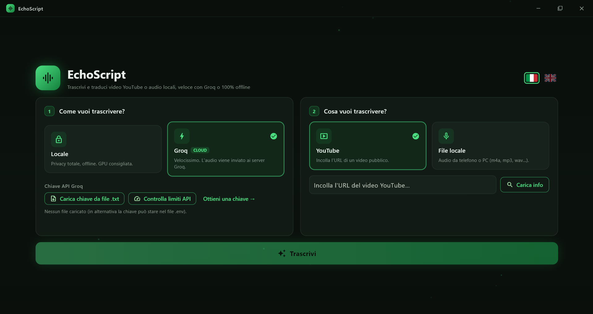

<div align="center">

# 🎙️ EchoScript

<p align="center">
  
  
  
  
  
  
  
</p>

<p align="center">
  Trascrivi i video YouTube <b>e i tuoi audio locali</b> in <b>testo, Markdown, JSON e PDF</b>,<br>
  <b>velocemente</b> con Groq oppure <b>100% in locale</b> per la massima privacy.<br>
  Pensato per <b>studiare</b> video lunghi (RAG, fine-tuning, lezioni) leggendoli invece di guardarli per ore.<br>
  Disponibile come <b>app desktop</b> (GUI) o da <b>terminale</b> (CLI).<br>
  <b>Niente abbonamenti, niente limiti giornalieri, niente minutaggio ridotto.</b>
</p>

</div>

```bash
git clone https://github.com/Imkun-on/EchoScript.git
cd EchoScript
pip install -r requirements.txt

python gui/main.py        # interfaccia grafica desktop (GUI)
python transcriber.py     # interfaccia da terminale (CLI)
```

---

## Indice

- [📋 Descrizione del progetto](#-descrizione-del-progetto)
- [🆚 Perché EchoScript e non i soliti "tool gratis"](#-perché-echoscript-e-non-i-soliti-tool-gratis)
- [🖥️ Due interfacce: GUI o terminale](#️-due-interfacce-gui-o-terminale)
- [🖱️ Guida all'app desktop (per tutti)](#️-guida-allapp-desktop-per-tutti)
- [🔀 I due backend: cloud o locale](#-i-due-backend-cloud-o-locale)
- [✨ Caratteristiche](#-caratteristiche)
- [⬇️ Scarica l'app pronta (.exe)](#️-scarica-lapp-pronta-exe)
- [📦 Installazione da sorgente (sviluppatori)](#-installazione-da-sorgente-sviluppatori)
- [🔑 Come ottenere una API key Groq](#-come-ottenere-una-api-key-groq)
- [📚 Librerie usate e perché](#-librerie-usate-e-perché)
- [🚀 Uso ed esempi](#-uso-ed-esempi)
- [⚙️ Come funziona (le fasi)](#️-come-funziona-le-fasi)
- [💾 Struttura dei file di output](#-struttura-dei-file-di-output)
- [📄 Esportazione PDF](#-esportazione-pdf)
- [🛠️ Configurazione](#️-configurazione)
- [🔒 Privacy](#-privacy)
- [⚖️ Note legali](#️-note-legali)
- [📄 Licenza](#-licenza)

---

## 📋 Descrizione del progetto

**EchoScript** è uno strumento (**app desktop** o **da terminale**) che trasforma un video YouTube in **testo scritto**, ordinato e pronto da leggere o da dare in pasto ad altri strumenti.

L'idea nasce da un bisogno concreto: i video formativi (su **RAG**, **fine-tuning**, lezioni, talk) spesso durano **1-2 ore**, e non sempre si ha il tempo o la concentrazione di seguirli tutti. EchoScript li **trascrive** usando i **capitoli** del video come sezioni, così puoi *leggere* il contenuto in pochi minuti, cercarlo, evidenziarlo, o usarlo come base di conoscenza.

Puoi scegliere **cosa** trascrivere:

- 📺 **un video YouTube**, da URL (scarica audio, info e capitoli);
- 🎙️ **un file audio locale** (note vocali del telefono, registrazioni del PC: `m4a`, `mp3`, `wav`, `ogg`, `opus`, anche video `mp4`/`mov`…), oppure **un'intera cartella** per trascriverli tutti in sequenza (batch).

E puoi scegliere **come** trascrivere:

- ⚡ **Groq (cloud)**: velocissimo anche **senza GPU** (trascrive 2 ore in pochi secondi), praticamente gratis.
- 🔒 **Locale (faster-whisper su CPU)**: **100% offline e privato**, l'audio non lascia mai il tuo PC.

A fine trascrizione puoi **esportare in PDF** per leggerla comodamente, divisa per capitoli.

Lo strumento è pensato per:

- 🎓 **Studenti e autodidatti** che vogliono leggere i video invece di guardarli per ore
- 🧠 **Chi costruisce un RAG / knowledge base** a partire dai video (l'output `.json` ha già i timestamp pronti per il chunking)
- 🔐 **Chi tiene alla privacy** e vuole una trascrizione totalmente offline

---

## 🆚 Perché EchoScript e non i soliti "tool gratis"

Molti siti e app di trascrizione si presentano come "gratis", ma poi scopri che:
- dopo pochi minuti chiedono di **pagare** o di sottoscrivere un **abbonamento**;
- impongono un **limite giornaliero** (es. 30 minuti al giorno) o un **tetto di durata** per video;
- bloccano i **video lunghi** (proprio quelli che servirebbe trascrivere);
- ti fanno **creare un account**, aggiungono **watermark** o degradano la qualità;
- caricano il tuo audio su **server sconosciuti**, senza alcuna garanzia di privacy.

EchoScript nasce per **eliminare tutte queste trappole**:

| | Tipico tool "gratis" online | **EchoScript** |
|---|---|---|
| **Costo reale** | gratis → poi paywall / abbonamento | **gratis davvero** in locale · quasi gratis con il free tier Groq (chiave tua) |
| **Limite giornaliero** | spesso pochi minuti/giorno | **nessuno** in locale |
| **Durata massima video** | spesso 10-30 min | **video da 2h+** senza problemi |
| **Account obbligatorio** | sì | **no** (locale); per Groq solo una chiave gratuita |
| **Watermark / qualità ridotta** | frequenti | **mai** |
| **Privacy** | upload su server terzi | **locale = niente lascia il tuo PC** |
| **Formati di output** | spesso solo `.txt` | `.md`, `.txt`, `.json`, **`.pdf`** |
| **Funziona offline** | no | **sì** (backend locale) |
| **Open source** | quasi mai | **sì** |

In breve: **lo controlli tu**, gira sul **tuo computer**, e non ti chiede nulla a sorpresa.

---

## 🖥️ Due interfacce: GUI o terminale

EchoScript si usa in **due modi**, con lo **stesso motore** sotto (stessa trascrizione, stessi formati di output):

- 🖥️ **App desktop (GUI)** con `python gui/main.py`: interfaccia grafica nativa (Flet), scura, con sfondo animato. Pensata per chi preferisce i clic.
- ⌨️ **Terminale (CLI)** con `python transcriber.py`: la classica interfaccia testuale (Rich), comoda per batch e automazioni.

La **GUI** aggiunge alcune comodità:

- 🌍 **Lingua dell'interfaccia** italiano/inglese, con selettore a bandiere
- ▶️ **Anteprima del video**: caricando un URL si apre una **finestra di conferma** con copertina e dati (canale, views, mi piace, iscritti, categoria, lingua)
- 🏷️ **Badge del motore** durante la trascrizione (Groq cloud o Locale CPU), così sai sempre con cosa stai trascrivendo
- 📊 **Barra di avanzamento reale** con il numero di fase (es. "Fase 2/5")
- 🌐 **Traduzione proposta in automatico** solo se l'audio non è già in italiano
- 📄 **PDF generato sempre** in automatico

> Entrambe scrivono gli stessi file in `results/<nome>/`. Scegli quella che preferisci: il risultato è identico.

---

## 🖱️ Guida all'app desktop (per tutti)

Questa sezione è pensata per chi **non è tecnico**: spieghiamo ogni schermata, ogni pulsante e ogni messaggio. **Non serve saper programmare.**

> ▶️ **Come si avvia:** doppio clic sull'eseguibile (se hai la versione pacchettizzata), oppure dalla cartella del progetto esegui `python gui/main.py`.

<p align="center">
  
</p>

### In alto: lingua e pulsanti finestra
- In alto a destra ci sono **due bandierine** 🇮🇹 / 🇬🇧: cliccale per cambiare la **lingua dell'interfaccia** (italiano o inglese). Tutto il testo cambia all'istante.
- I tre pulsantini in cima (**–**, **▢**, **✕**) servono a **minimizzare**, **ingrandire** e **chiudere** la finestra, come in ogni programma.

### Passo 1 — "Come vuoi trascrivere?"
Due riquadri da scegliere (si illuminano di verde quando selezionati):
- 🔒 **Locale**: trascrive **sul tuo computer**, **senza internet** e senza inviare nulla. Sotto puoi scegliere il **modello** (più accurato = più lento). Consigliato se hai una GPU; su CPU è più lento.
- ⚡ **Groq (cloud)**: **velocissimo**, ma l'audio viene inviato ai server Groq. Richiede una **chiave gratuita**: clicca **"Carica chiave da file .txt"** e seleziona il file con la tua chiave. Il pulsante **"Controlla limiti API"** mostra quanti **crediti gratuiti** ti restano oggi; **"Ottieni una chiave →"** apre il sito dove crearla.

### Passo 2 — "Cosa vuoi trascrivere?"
- 📺 **YouTube**: incolla il **link** del video nel campo e clicca **"Carica info"**.
- 🎙️ **File locale**: clicca **"Scegli file audio…"** e prendi un file dal computer (vanno bene anche **video** e **registrazioni schermo**).

### La finestra di conferma del video (YouTube)
Dopo **"Carica info"** si apre una finestra con la **copertina** del video e i suoi dati (canale, visualizzazioni, mi piace, iscritti, durata, lingua…). Ti chiede: *è questo il video giusto?*
- **Conferma** → accetti il video (sotto compare *"✓ Video confermato"*).
- **Annulla** → lo scarti e puoi incollarne un altro.

### Il pulsante "Trascrivi"
È il grande pulsante verde in basso. Si **attiva** solo quando è tutto pronto. Se lo premi prima, compare una **finestra d'avviso** che ti **elenca cosa manca**, ad esempio:
- *caricare la chiave API Groq* (solo se usi Groq);
- *caricare e confermare il video YouTube*, oppure *scegliere un file audio*.

### Durante la trascrizione
Compare una **barra di avanzamento reale** (non un'animazione finta):
- in alto un **badge** dice con cosa stai trascrivendo: **Groq (cloud)** (verde) o **Locale CPU** (arancione, perché può richiedere minuti);
- a destra il **numero di fase** (es. *"Fase 2/5"*) e la **percentuale** complessiva.

### A fine trascrizione
Il **PDF viene creato sempre**, in automatico, e i file vengono salvati senza ulteriori domande.

### Il risultato
Una finestra **"Completato!"** riassume tutto: motore usato, numero di parole/sezioni, **dove sono stati salvati i file** (cartella `results/`) e l'elenco dei file creati. Il pulsante **"Apri cartella risultati"** apre direttamente la cartella.

### Messaggi speciali (video lungo o già fatto)
- 🔁 **"Video già trascritto"**: se rifai un video già fatto, l'app ti chiede se **Ritrascrivere tutto** (sostituisce i file).
- ⏸️ **"Ripresa disponibile"**: se una trascrizione lunga si era interrotta (limite Groq, o trascrizione locale interrotta), l'app ha **salvato il punto** e ti propone di **Riprendere** da dove si era fermata o **Ricominciare** da capo.
- ⏳ **"Limite Groq raggiunto"**: avviso arancione che indica quanti blocchi sono stati fatti; **riprendi più tardi**, quando tornano i crediti gratuiti.

---

## 🔀 I due backend: cloud o locale

All'avvio un pannello ti fa scegliere il motore di trascrizione:

| Backend | Privacy | Velocità (senza GPU) | Costo | Quando usarlo |
|---|---|---|---|---|
| 🔒 **Locale** (faster-whisper) | **Massima**: l'audio resta sul PC | 🐢 Più lento | **Gratis** | Audio privati/sensibili, nessun limite |
| ⚡ **Groq** (cloud) | L'audio va sui server Groq | ⚡ Velocissimo | Free tier generoso | Video YouTube pubblici, quando hai fretta |

Se scegli **Locale**, un secondo pannello ti fa scegliere il modello ogni volta:

| Modello | Velocità ↔ Accuratezza |
|---|---|
| `base` | veloce, meno accurato |
| `small` ⭐ | equilibrio consigliato |
| `medium` | più accurato, più lento |
| `large-v3` | massima accuratezza, molto lento su CPU |
| `large-v3-turbo` | quasi "large" ma più rapido |

> Al primo uso di un modello locale, `faster-whisper` ne scarica i **pesi** da HuggingFace (una volta sola). L'**audio**, però, non viene mai inviato da nessuna parte.

---

## ✨ Caratteristiche

- 🖥️ **Due interfacce**: app desktop **GUI** (`gui/main.py`) o **CLI** da terminale (`transcriber.py`)
- 🔀 **Due backend** selezionabili da pannello: Groq (cloud, veloce) o faster-whisper (locale, privato)
- 🎙️ **Due sorgenti**: video **YouTube** (da URL) o **file audio locali** (telefono/PC), anche le **registrazioni schermo** (`mp4`/`mov`/`mkv`…), anche un'**intera cartella** in batch
- 📋 **Scheda video** prima di partire (titolo, canale, visualizzazioni, **mi piace, iscritti, categoria, lingua**, data, durata, capitoli)
- 🗣️ **Lingua dell'audio rilevata** automaticamente (Whisper) e mostrata nel riepilogo
- ✅ **Conferma** prima di trascrivere
- ⬇️ **Download solo audio** (leggero) con barra di avanzamento (velocità + tempo stimato)
- ⏱️ **Minutaggi e sezioni**: usa i **capitoli** di YouTube come sezioni del documento
- 💾 **3 formati base** sempre generati: `.md` (umano), `.txt` (per altri LLM), `.json` (per RAG)
- 📄 **PDF generato sempre** in automatico, diviso per capitoli
- 🗂️ **Output organizzato** in `results/<nome video>/` nella sottocartella `trascrizioni/`
- 🎨 **Interfacce curate**: GUI scura con sfondo animato, oppure CLI Rich con barre e pannelli
- 🔑 **Gestione chiave sicura**: variabile d'ambiente o file `.env` (mai nel codice)
- 🧯 **Errori chiari**: la chiave viene validata all'avvio; niente retry inutili su errori di autenticazione

---

## ⬇️ Scarica l'app pronta (.exe)

Se **non sei uno sviluppatore** e vuoi solo usare il programma, non serve installare Python né altro: scarica l'app già pronta.

1. Vai alla pagina **[Releases](https://github.com/Imkun-on/EchoScript/releases/latest)** del progetto su GitHub.
2. Scarica il file **`EchoScript-Windows.zip`** dell'ultima versione.
3. **Estrai** lo ZIP in una cartella a piacere (Desktop, Documenti…). Tieni i file **insieme**: serve sia `EchoScript.exe` sia la cartella **`_internal`** che lo accompagna.
4. Doppio click su **`EchoScript.exe`**. Fatto: si apre l'app, **senza installare nulla**.

> 🛡️ **Primo avvio – Windows SmartScreen:** poiché l'app non è firmata digitalmente, Windows può mostrare *"Windows ha protetto il PC"*. Clicca **"Ulteriori informazioni" → "Esegui comunque"**. È normale per i programmi gratuiti non firmati.

**Cosa è incluso e cosa no:**
- ✅ **Tutto incluso**: non servono Python, ffmpeg o altre installazioni.
- 📥 La **prima volta** che usi il backend **locale**, l'app scarica una tantum il modello da HuggingFace (poi resta in cache, anche offline).
- ⚡ Per il backend **Groq** (cloud) serve solo una **chiave gratuita** (vedi più sotto).
- 💻 La release `.exe` è per **Windows**. Le versioni per **macOS/Linux** arrivano dai rispettivi build (vedi sezione installazione da sorgente nel frattempo).

> Per **disinstallare** basta cancellare la cartella: l'app non scrive nel registro di sistema. (Le trascrizioni stanno in `results/` accanto all'eseguibile.)

---

## 📦 Installazione da sorgente (sviluppatori)

Questa parte serve solo se vuoi **eseguire dal codice** o **modificare** il progetto. Per il semplice uso, vedi [Scarica l'app pronta (.exe)](#️-scarica-lapp-pronta-exe).

### Requisiti

- **Python 3.10+**
- **[ffmpeg](https://ffmpeg.org)** installato nel sistema (serve a yt-dlp e alla preparazione audio)
- *(solo per Groq)* una **API key Groq** gratuita (vedi sotto)
- *(solo per il backend locale)* `faster-whisper`
- *(solo per l'export PDF)* `fpdf2`
- *(solo per la GUI desktop)* `flet`

### Passi

```bash
git clone https://github.com/Imkun-on/EchoScript.git
cd EchoScript
pip install -r requirements.txt
python transcriber.py
```

Installazione di **ffmpeg**:

```bash
# Windows
winget install Gyan.FFmpeg
# macOS
brew install ffmpeg
# Linux (Debian/Ubuntu)
sudo apt install ffmpeg
```

> ⭐ **File da lanciare:** la **GUI** da `gui/main.py`, la **CLI** da `transcriber.py`.

---

## 🔑 Come ottenere una API key Groq

La chiave serve **solo** se usi il backend **Groq** (cloud). È **gratuita**.

1. Vai su **https://console.groq.com** e **registrati** (puoi usare Google, GitHub o email).
2. Una volta dentro, apri la sezione **API Keys**: **https://console.groq.com/keys**
3. Clicca su **"Create API Key"**, dai un nome (es. `echoscript`) e **conferma**.
4. **Copia subito** la chiave (inizia con `gsk_...`): viene mostrata **una sola volta**.
5. Incollala nel file **`.env`** del progetto:
   ```
   GROQ_API_KEY=gsk_la-tua-chiave-qui
   ```
   In alternativa, impostala come variabile d'ambiente:
   ```powershell
   # Windows (PowerShell), poi riapri il terminale
   setx GROQ_API_KEY "gsk_la-tua-chiave-qui"
   ```
   ```bash
   # macOS / Linux
   export GROQ_API_KEY="gsk_la-tua-chiave-qui"
   ```
6. Fatto! Se non la imposti, il programma te la chiede all'avvio (senza salvarla).

> 📊 **Limiti del free tier**: Groq impone dei *rate limit* (richieste al minuto/giorno e secondi di audio all'ora/giorno). Sono generosi, ma un singolo video da 2h potrebbe avvicinarsi al limite orario: in tal caso ricevi un errore `429` e basta attendere. Controlli sempre i tuoi limiti su **https://console.groq.com/settings/limits**. Se preferisci nessun limite, usa il **backend locale**.

> 🔐 La chiave è **segreta**: il file `.env` è già in `.gitignore`, quindi **non finirà mai su GitHub**.

---

## 📚 Librerie usate e perché

### Dipendenze esterne (pip)

| Libreria | A cosa serve | Perché proprio questa |
|---|---|---|
| `yt-dlp` | Scarica audio e metadati (titolo, capitoli, durata) da YouTube | Lo standard de facto: gestisce stream, resume, e l'estrazione dei metadati |
| `groq` | Client ufficiale dell'API Groq (Whisper) | SDK ufficiale, semplice e veloce |
| `rich` | Interfaccia da terminale: pannelli, tabelle, barre, colori | Trasforma la CLI in un'esperienza curata (`Panel`, `Progress`, `Columns`) |
| `faster-whisper` | *(opzionale)* Trascrizione **locale** su CPU | Implementazione ottimizzata di Whisper (CTranslate2), ottima su CPU con `int8` |
| `fpdf2` | *(opzionale)* Esportazione in **PDF** | Pure-python, **niente LaTeX di sistema**; supporta font Unicode |
| `flet` | *(opzionale)* **GUI desktop** (`gui/main.py`) | Interfaccia grafica nativa moderna in Python; la CLI funziona senza |

### Libreria standard (nessuna installazione)

`os`, `re`, `json`, `sys`, `signal`, `shutil`, `tempfile`, `subprocess`, `datetime`: percorsi/file, regex, JSON, gestione Ctrl+C, chiamate a ffmpeg/ffprobe, date.

---

## 🚀 Uso ed esempi

Avvia il programma:

```bash
python transcriber.py
```

Flusso tipico:

1. **Scegli il backend** (1 = Locale · 2 = Groq).
2. *(se locale)* **Scegli il modello** (1-5).
3. **Scegli la sorgente** (1 = YouTube · 2 = File locale).
4. **Indica cosa trascrivere**: l'**URL** del video, oppure il **percorso** di un file audio o di una **cartella** (batch).
5. Controlla la **scheda** (video o file) e **conferma**.
6. Attendi: vedrai le fasi (**Download** se da YouTube → **Preparazione** se Groq → **Trascrizione**) con barre di avanzamento, e il motore in uso (**Groq cloud** o **Locale CPU**).
7. Il **PDF viene generato sempre**, in automatico.
8. Trovi tutto in `results/<nome>/`.

> 🎙️ **File locali**: il download non serve (il file ce l'hai già) e i metadati YouTube (canale, capitoli…) non esistono, quindi l'output usa il **nome del file** come titolo e una singola sezione "testo continuo". Indicando una **cartella**, ogni file audio al suo interno viene trascritto in sequenza, riusando lo stesso motore e le stesse scelte di export.

### Esempio: backend Groq

```
─────────────── Come vuoi trascrivere? ───────────────
┌─ 1  🔒 Locale ──────────────┐  ┌─ 2  ⚡ Groq (cloud) ────────┐
│  ✓ privacy totale: resta... │  │  ✓ velocissimo, anche...    │
│  ✗ più lento (nessuna GPU)  │  │  ✗ niente privacy: cloud    │
│  • per audio privati        │  │  • per video pubblici       │
└─────────────────────────────┘  └─────────────────────────────┘

› Scelta (1 = Locale · 2 = Groq · q = annulla): 2

──────────────── Cosa vuoi trascrivere? ────────────────
┌─ 1  📺 YouTube ─────────────┐  ┌─ 2  🎙 File locale ─────────┐
│  ✓ incolli l'URL di un video│  │  ✓ audio da telefono/PC     │
│  ✓ scarica audio, info, cap.│  │  ✓ anche una cartella (batch)│
│  • per video pubblici online│  │  • per note vocali          │
└─────────────────────────────┘  └─────────────────────────────┘

› Scelta (1 = YouTube · 2 = File locale · q = annulla): 1

› Incolla l'URL del video YouTube (q per uscire): https://www.youtube.com/watch?v=...

┌─ 🎬 RAG è già vecchio? ... ──────────────────────┐
│  📺  Canale           Simone Rizzo               │
│  👁  Visualizzazioni  49.586                     │
│  👍  Mi piace         2.350                       │
│  👥  Iscritti         128.000                     │
│  🏷  Categoria        Science & Technology        │
│  🗣  Lingua           Italiano                    │
│  📅  Pubblicato       21/04/2026                 │
│  ⏱  Durata           43:09                       │
│  📑  Capitoli         21 sezioni                 │
└──────────────────────────────────────────────────┘

› Procedo con la trascrizione di questo video? (s/n): s

──── ⬇ Fase 1/3 — Download audio ────
──── ✂ Fase 2/3 — Preparazione audio ────
──── ✎ Fase 3/3 — Trascrizione · Groq (cloud) ────
```

### Esempio: file audio locale (cartella in batch)

```
› Scelta (1 = Locale · 2 = Groq · q = annulla): 1
› Modello (1-5 · q = annulla): 2
› Scelta (1 = YouTube · 2 = File locale · q = annulla): 2

› Incolla il percorso del file o della cartella audio (q per uscire): C:\Users\io\note_vocali

┌─ 🎙 3 file da trascrivere ───────────────────────┐
│  #   File                              Durata     │
│  1   lezione_01.m4a                     12:04     │
│  2   riunione_lunedi.mp3                47:31     │
│  3   memo.wav                            1:58     │
└──────────────────── durata totale ~1:01:33 ──────┘

› Procedo con la trascrizione di questi 3 file? (s/n): s

──── ✎ Fase 1/1 — Trascrizione · Locale CPU (small) ────   (per ogni file)
```

### Caso d'uso: costruire un RAG dai video

Trascrivi i video di studio, poi usa i file **`.json`** (segmenti con timestamp) come fonte per la tua pipeline RAG: sono già pronti per il *chunking* e l'indicizzazione.

### Caso d'uso: leggere un talk invece di guardarlo

Trascrivi un talk lungo e usa l'**export PDF**: ottieni un PDF pulito, diviso per capitoli, da leggere sul tablet o stampare.

---

## ⚙️ Come funziona (le fasi)

1. **Info**: con una chiamata leggera (`yt-dlp`) si leggono SOLO i metadati (titolo, canale, durata, **capitoli**), senza scaricare nulla.
2. **Download audio**: si scarica la sola traccia audio (leggera) con barra di avanzamento.
3. **Preparazione** *(solo Groq)*: l'audio viene riconvertito a 16 kHz mono e **spezzato in blocchi da ~10 min** (per stare nei limiti di dimensione dell'API e avere una barra sensata).
4. **Trascrizione**: ogni blocco (Groq) o l'intero file (locale) viene trascritto in **segmenti con timestamp**; i minutaggi di ogni blocco vengono corretti rispetto all'intero video.
5. **Assemblaggio**: i segmenti vengono raggruppati per **capitolo** (se presenti) e salvati nei vari formati.
6. **Export PDF**: sempre, in automatico.

> 🎙️ **Con un file locale** i passi *Info* e *Download* non servono: il file viene dato direttamente a ffmpeg/Whisper. La durata si ricava con `ffprobe`, il titolo dal nome del file e, non essendoci capitoli, si ottiene un'unica sezione "testo continuo".

---

## 💾 Struttura dei file di output

```
results/
└── <Nome Video o nome file>/
    └── trascrizioni/
        ├── <Nome>.md      (sezioni con minutaggio nel titolo, prosa pulita)
        ├── <Nome>.txt     (testo pulito, per altri LLM)
        ├── <Nome>.json    (segmenti con timestamp, per RAG)
        └── <Nome>.pdf     (sempre, generato in automatico)
```

> Per i **file locali** `<Nome>` è il nome del file (senza estensione); per i video YouTube è il titolo. In **batch** ogni file produce la sua cartella `results/<nome file>/`.

- **`.md`**: leggibile dall'uomo: i minutaggi compaiono **solo nei titoli di sezione**, il corpo è prosa scorrevole.
- **`.txt`**: testo pulito senza timestamp: ideale da **incollare in un altro LLM** (ChatGPT/Claude).
- **`.json`**: metadati + capitoli + **tutti i segmenti con timestamp**: perfetto per una pipeline **RAG**.

---

## 📄 Esportazione PDF

Il **PDF viene generato sempre, in automatico**. EchoScript crea:

- **`.pdf`**: tramite `fpdf2` (pure-python, **niente LaTeX da installare**, font Arial per gli accenti), **diviso per capitoli**.

---

## 🛠️ Configurazione

Tutte le "manopole" si impostano da variabili d'ambiente / file `.env` (vedi
il file `.env`), senza toccare il codice. Ogni valore ha un default sensato:

| Variabile `.env` | Default | Descrizione |
|---|---|---|
| `GROQ_API_KEY` | — | Chiave Groq (solo per la trascrizione cloud) |
| `ECHOSCRIPT_GROQ_MODEL` | `whisper-large-v3-turbo` | Modello Whisper su Groq (turbo = veloce/economico) |
| `ECHOSCRIPT_AUDIO_LANG` | *(vuoto)* | Lingua dell'audio: vuoto = autorileva; forza con `it` / `en` / … |
| `ECHOSCRIPT_WORD_TIMESTAMPS` | `1` | Timestamp a livello di parola (utili per sottotitoli) |
| `ECHOSCRIPT_CHUNK_SECONDS` | `600` | Durata di ogni blocco audio (solo Groq) |
| `ECHOSCRIPT_DEVICE` | `auto` | Backend locale: `auto` (GPU se c'è) / `cpu` / `cuda` |
| `ECHOSCRIPT_COMPUTE_TYPE` | *(auto)* | Precisione locale: vuoto = `float16` su GPU, `int8` su CPU |

> **Nota.** La traduzione è temporaneamente disabilitata: per ora EchoScript fa
> solo trascrizione. Verrà reintrodotta in futuro.

> **GPU automatica.** Il backend locale usa la GPU (CUDA) se disponibile,
> altrimenti la CPU. Installa PyTorch con CUDA per l'accelerazione (vedi
> `requirements.txt`).

---

## 🔒 Privacy

- **Backend locale (faster-whisper)**: l'**audio non lascia mai il tuo PC**. (Al primo uso scarica solo i *pesi* del modello da HuggingFace.) Massima privacy.
- **Backend Groq**: l'audio viene **caricato sui server Groq** per la trascrizione. Ottimo per video pubblici, sconsigliato per audio privati/sensibili.
- **Traduzione**: usa Groq, quindi il testo viene inviato ai loro server (con avviso se hai trascritto in locale).

La **API key** non è mai scritta nel codice: si legge da `.env` o da variabile d'ambiente, ed è esclusa dal versionamento tramite `.gitignore`.

---

## ⚖️ Note legali

EchoScript scarica l'audio da YouTube per trascriverlo. L'uso potrebbe essere soggetto ai **Termini di Servizio** di YouTube e alle norme sul **diritto d'autore** della tua giurisdizione. È pensato per uso **personale ed educativo** (es. studiare un video leggendolo): usalo in modo responsabile e solo per contenuti di cui hai i diritti o per fini di studio personale.

---

## 📄 Licenza

Rilasciato sotto licenza **MIT**.

---

<div align="center">
🇬🇧 <a href="README_eng.md">Read this in English</a>
</div>
