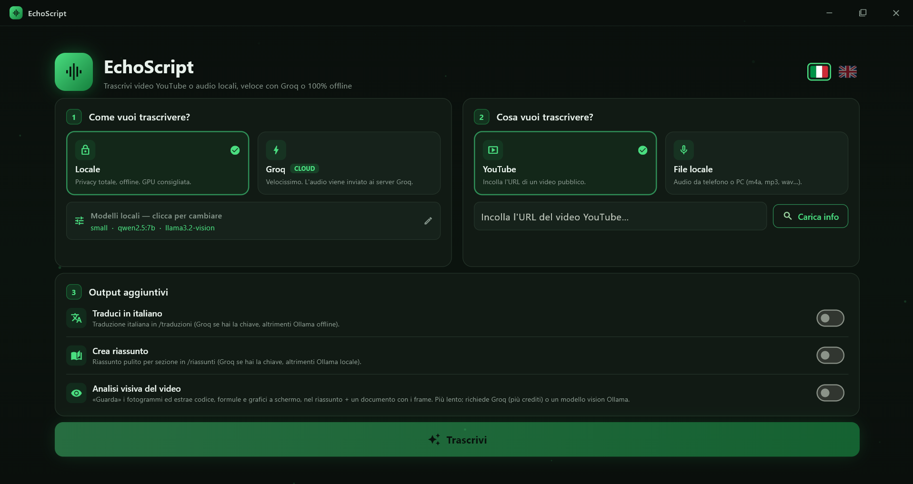
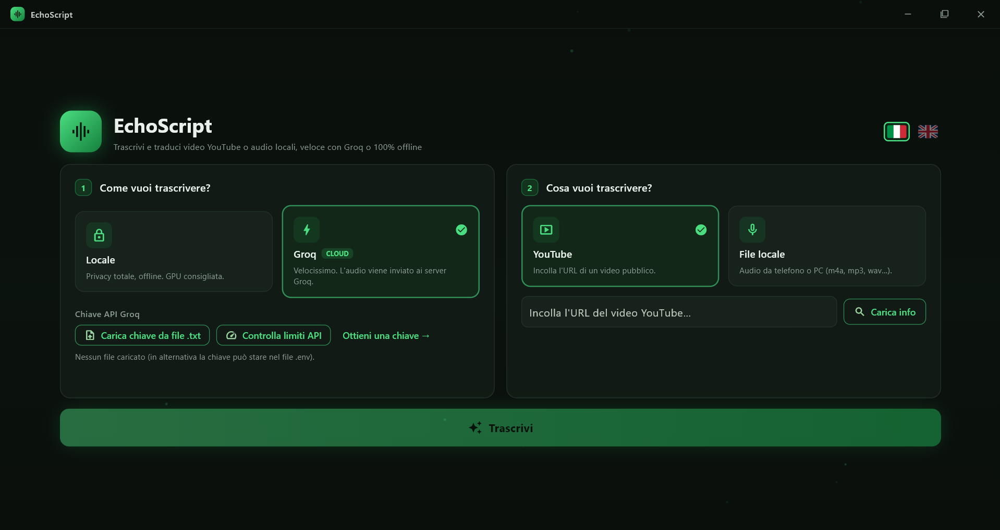

<div align="center">

# 🎙️ EchoScript

<p align="center">
  
  
  
  
  
  
  
  
  
  
  
  
</p>

<p align="center">
  Trascrivi i video YouTube <b>e i tuoi audio locali</b> in <b>testo, Markdown, JSON e PDF</b>,<br>
  poi <b>traducili</b> in italiano e ottienine un <b>riassunto pulito</b> (senza "ehm/uhm", ripetizioni e autocorrezioni).<br>
  <b>Velocemente</b> con Groq oppure <b>100% in locale</b> per la massima privacy.<br>
  Pensato per <b>studiare</b> video lunghi (RAG, fine-tuning, lezioni) leggendoli invece di guardarli per ore.<br>
  Disponibile come <b>app desktop</b> (GUI) o da <b>terminale</b> (CLI).<br>
  <b>Niente abbonamenti, niente limiti giornalieri, niente minutaggio ridotto.</b>
</p>



<p align="center"><i>L'app desktop: scegli il motore, incolla un link (o un file) e premi <b>Trascrivi</b>.</i></p>

</div>

```bash
git clone https://github.com/Imkun-on/EchoScript.git
cd EchoScript
pip install -r requirements.txt

python gui/main.py        # interfaccia grafica desktop (GUI)
python transcriber.py     # interfaccia da terminale (CLI)
```

---

## 📖 Indice

**Capitolo 1 — [📋 Descrizione del progetto](#-descrizione-del-progetto)**

**Capitolo 2 — [🆚 Perché EchoScript e non i soliti "tool gratis"](#-perché-echoscript-e-non-i-soliti-tool-gratis)**

**Capitolo 3 — [🖥️ Due interfacce: GUI o terminale](#️-due-interfacce-gui-o-terminale)**

**Capitolo 4 — [🖱️ Guida all'app desktop (per tutti)](#️-guida-allapp-desktop-per-tutti)**
- 4.1 [In alto: lingua e pulsanti finestra](#in-alto-lingua-e-pulsanti-finestra)
- 4.2 [Passo 1 — "Come vuoi trascrivere?"](#passo-1--come-vuoi-trascrivere)
- 4.3 [Passo 2 — "Cosa vuoi trascrivere?"](#passo-2--cosa-vuoi-trascrivere)
- 4.4 [La finestra di conferma del video (YouTube)](#la-finestra-di-conferma-del-video-youtube)
- 4.5 [Le playlist YouTube](#le-playlist-youtube)
- 4.6 [Passo 3 — "Output aggiuntivi" (opzionale)](#passo-3--output-aggiuntivi-opzionale)
- 4.7 [Il pulsante "Trascrivi"](#il-pulsante-trascrivi)
- 4.8 [Durante la trascrizione](#durante-la-trascrizione)
- 4.9 [A fine trascrizione](#a-fine-trascrizione)
- 4.10 [Il risultato](#il-risultato)
- 4.11 [Messaggi speciali (video lungo o già fatto)](#messaggi-speciali-video-lungo-o-già-fatto)

**Capitolo 5 — [🔀 I due backend: cloud o locale](#-i-due-backend-cloud-o-locale)**

**Capitolo 6 — [🧬 I modelli usati (guida completa)](#-i-modelli-usati-guida-completa)**
- 6.1 [Le icone dei modelli](#le-icone-dei-modelli)
- 6.2 [Parametri, quantizzazione, contesto: il glossario minimo](#parametri-quantizzazione-contesto-il-glossario-minimo)
- 6.3 [🎙️ Trascrizione — la famiglia Whisper](#️-trascrizione--la-famiglia-whisper)
- 6.4 [🧠 Riassunto e traduzione — i modelli di testo](#-riassunto-e-traduzione--i-modelli-di-testo)
- 6.5 [👁️ Analisi visiva — i modelli vision](#️-analisi-visiva--i-modelli-vision)
- 6.6 [Come leggere la colonna "RAM"](#come-leggere-la-colonna-ram)

**Capitolo 7 — [✨ Caratteristiche](#-caratteristiche)**

**Capitolo 8 — [⬇️ Scarica l'app pronta (.exe)](#️-scarica-lapp-pronta-exe)**

**Capitolo 9 — [📦 Installazione da sorgente (sviluppatori)](#-installazione-da-sorgente-sviluppatori)**
- 9.1 [Requisiti](#requisiti)
- 9.2 [Passi](#passi)

**Capitolo 10 — [🔑 Come ottenere una API key Groq](#-come-ottenere-una-api-key-groq)**

**Capitolo 11 — [📚 Librerie usate e perché](#-librerie-usate-e-perché)**
- 11.1 [Dipendenze esterne (pip)](#dipendenze-esterne-pip)
- 11.2 [Strumento esterno (non pip)](#strumento-esterno-non-pip)
- 11.3 [Libreria standard (nessuna installazione)](#libreria-standard-nessuna-installazione)

**Capitolo 12 — [🚀 Uso ed esempi](#-uso-ed-esempi)**
- 12.1 [Esempio: backend Groq](#esempio-backend-groq)
- 12.2 [Esempio: file audio locale (cartella in batch)](#esempio-file-audio-locale-cartella-in-batch)
- 12.3 [Caso d'uso: costruire un RAG dai video](#caso-duso-costruire-un-rag-dai-video)
- 12.4 [Caso d'uso: leggere un talk invece di guardarlo](#caso-duso-leggere-un-talk-invece-di-guardarlo)

**Capitolo 13 — [⚙️ Come funziona (le fasi)](#️-come-funziona-le-fasi)**

**Capitolo 14 — [💾 Struttura dei file di output](#-struttura-dei-file-di-output)**
- 14.1 [Perché tre (anzi quattro) formati e a cosa servono](#perché-tre-anzi-quattro-formati-e-a-cosa-servono)

**Capitolo 15 — [📄 Esportazione PDF](#-esportazione-pdf)**

**Capitolo 16 — [🌐 Traduzione automatica](#-traduzione-automatica)**
- 16.1 [Come viene risolto il problema dei video lunghi (a blocchi)](#come-viene-risolto-il-problema-dei-video-lunghi-a-blocchi)

**Capitolo 17 — [🧠 Riassunto automatico](#-riassunto-automatico)**
- 17.1 [Perché serve anche un riassunto](#perché-serve-anche-un-riassunto)
- 17.2 [Quali modelli sono stati introdotti e perché](#quali-modelli-sono-stati-introdotti-e-perché)
- 17.3 [Scegliere il modello locale (CLI e GUI)](#scegliere-il-modello-locale-cli-e-gui)
- 17.4 [Il problema dei video lunghi: map-reduce + contesto](#il-problema-dei-video-lunghi-map-reduce--contesto)
- 17.5 [Il prompt usato (identico per Groq e Ollama)](#il-prompt-usato-identico-per-groq-e-ollama)
- 17.6 [Su un video già trascritto (rigenerare senza rispendere)](#su-un-video-già-trascritto-rigenerare-senza-rispendere)

**Capitolo 18 — [👁️ Analisi visiva del video](#️-analisi-visiva-del-video)**
- 18.1 [A cosa serve](#a-cosa-serve)
- 18.2 [Come funziona (in 4 passi)](#come-funziona-in-4-passi)
- 18.3 [Perché così (e non un'"immagine generata")](#perché-così-e-non-unimmagine-generata)
- 18.4 [Cosa ottieni](#cosa-ottieni)
- 18.5 [Costo, requisiti e limiti (in chiaro)](#costo-requisiti-e-limiti-in-chiaro)
- 18.6 [Configurazione](#configurazione)

**Capitolo 19 — [🛠️ Configurazione](#️-configurazione)**

**Capitolo 20 — [🔒 Privacy](#-privacy)**

**Capitolo 21 — [💬 Feedback](#-feedback)**

**Capitolo 22 — [⚖️ Note legali](#️-note-legali)**

**Capitolo 23 — [📄 Licenza](#-licenza)**

---

## 📋 Descrizione del progetto

**EchoScript** è uno strumento (**app desktop** o **da terminale**) che trasforma un video YouTube in **testo scritto**, ordinato e pronto da leggere o da dare in pasto ad altri strumenti.

L'idea nasce da un bisogno concreto: i video formativi (su **RAG**, **fine-tuning**, lezioni, talk) spesso durano **1-2 ore**, e non sempre si ha il tempo o la concentrazione di seguirli tutti. EchoScript li **trascrive** usando i **capitoli** del video come sezioni, così puoi *leggere* il contenuto in pochi minuti, cercarlo, evidenziarlo, o usarlo come base di conoscenza.

Puoi scegliere **cosa** trascrivere:

- 📺 **un video YouTube**, da URL (scarica audio, info e capitoli);
- ▶️ **un'intera playlist YouTube**: incolli il link della playlist e trascrive **tutti** i suoi video in sequenza, salvandoli in una cartella con il nome della playlist (una sottocartella per ogni video);
- 🎙️ **un file audio locale** (note vocali del telefono, registrazioni del PC: `m4a`, `mp3`, `wav`, `ogg`, `opus`, anche video `mp4`/`mov`…), oppure **un'intera cartella** per trascriverli tutti in sequenza (batch).

E puoi scegliere **come** trascrivere:

- ⚡ **Groq (cloud)**: velocissimo anche **senza GPU** (trascrive 2 ore in pochi secondi), praticamente gratis.
- 🔒 **Locale (faster-whisper su CPU)**: **100% offline e privato**, l'audio non lascia mai il tuo PC.

A fine trascrizione puoi **esportare in PDF** per leggerla comodamente, divisa per capitoli.

Lo strumento è pensato per:

- 🎓 **Studenti e autodidatti** che vogliono leggere i video invece di guardarli per ore
- 🧠 **Chi costruisce un RAG / knowledge base** a partire dai video (l'output `.json` ha già i timestamp pronti per il chunking)
- 🔐 **Chi tiene alla privacy** e vuole una trascrizione totalmente offline

---

## 🆚 Perché EchoScript e non i soliti "tool gratis"

Molti siti e app di trascrizione si presentano come "gratis", ma poi scopri che:
- dopo pochi minuti chiedono di **pagare** o di sottoscrivere un **abbonamento**;
- impongono un **limite giornaliero** (es. 30 minuti al giorno) o un **tetto di durata** per video;
- bloccano i **video lunghi** (proprio quelli che servirebbe trascrivere);
- ti fanno **creare un account**, aggiungono **watermark** o degradano la qualità;
- caricano il tuo audio su **server sconosciuti**, senza alcuna garanzia di privacy.

EchoScript nasce per **eliminare tutte queste trappole**:

| | Tipico tool "gratis" online | **EchoScript** |
|---|---|---|
| **Costo reale** | gratis → poi paywall / abbonamento | **gratis davvero** in locale · quasi gratis con il free tier Groq (chiave tua) |
| **Limite giornaliero** | spesso pochi minuti/giorno | **nessuno** in locale |
| **Durata massima video** | spesso 10-30 min | **video da 2h+** senza problemi |
| **Account obbligatorio** | sì | **no** (locale); per Groq solo una chiave gratuita |
| **Watermark / qualità ridotta** | frequenti | **mai** |
| **Privacy** | upload su server terzi | **locale = niente lascia il tuo PC** |
| **Formati di output** | spesso solo `.txt` | `.md`, `.txt`, `.json`, **`.pdf`** |
| **Funziona offline** | no | **sì** (backend locale) |
| **Open source** | quasi mai | **sì** |

In breve: **lo controlli tu**, gira sul **tuo computer**, e non ti chiede nulla a sorpresa.

---

## 🖥️ Due interfacce: GUI o terminale

EchoScript si usa in **due modi**, con lo **stesso motore** sotto (stessa trascrizione, stessi formati di output):

- 🖥️ **App desktop (GUI)** con `python gui/main.py`: interfaccia grafica nativa (Flet), scura, con sfondo animato. Pensata per chi preferisce i clic.
- ⌨️ **Terminale (CLI)** con `python transcriber.py`: la classica interfaccia testuale (Rich), comoda per batch e automazioni.

La **GUI** aggiunge alcune comodità:

- 🌍 **Lingua dell'interfaccia** italiano/inglese, con selettore a bandiere
- ▶️ **Anteprima del video**: caricando un URL si apre una **finestra di conferma** con copertina e dati (canale, views, mi piace, iscritti, categoria, lingua)
- 🏷️ **Badge del motore** durante la trascrizione (Groq cloud o Locale CPU), così sai sempre con cosa stai trascrivendo
- 📊 **Finestra di avanzamento dedicata**: barra reale, checklist dei passaggi e una frase su cosa sta avvenendo
- 🌐 **Traduzione in italiano** e 🧠 **riassunto** attivabili con due interruttori (card "Output aggiuntivi")
- 💰 **Crediti API Groq**: un pulsante apre, **per ogni modello** (trascrizione, riassunto, analisi visiva), i **crediti utilizzati**, **rimanenti** e il **ripristino** (quando si azzerano). I dati sono letti da una cache passiva: **il pulsante non consuma nulla** e i numeri non calano cliccandolo
- 📄 **PDF generato sempre** in automatico

> Entrambe scrivono gli stessi file in `results/<nome>/`. Scegli quella che preferisci: il risultato è identico.

---

## 🖱️ Guida all'app desktop (per tutti)

Questa sezione è pensata per chi **non è tecnico**: spieghiamo ogni schermata, ogni pulsante e ogni messaggio. **Non serve saper programmare.**

> ▶️ **Come si avvia:** doppio clic sull'eseguibile (se hai la versione pacchettizzata), oppure dalla cartella del progetto esegui `python gui/main.py`.

<p align="center">
  
</p>

### In alto: lingua e pulsanti finestra
- In alto a destra ci sono **due bandierine** 🇮🇹 / 🇬🇧: cliccale per cambiare la **lingua dell'interfaccia** (italiano o inglese). Tutto il testo cambia all'istante.
- I tre pulsantini in cima (**–**, **▢**, **✕**) servono a **minimizzare**, **ingrandire** e **chiudere** la finestra, come in ogni programma.

### Passo 1 — "Come vuoi trascrivere?"
Due riquadri da scegliere (si illuminano di verde quando selezionati):
- 🔒 **Locale**: trascrive **sul tuo computer**, **senza internet** e senza inviare nulla. Al click si apre la finestra **"Modelli locali"** con le tre scelte: modello **Whisper** (trascrizione, più accurato = più lento), modello **Ollama** per riassunto/traduzione e modello **Ollama vision** per l'analisi visiva (con ✓ su quelli già scaricati). Una **riga di riepilogo** nella card mostra i modelli scelti e, cliccata, riapre la finestra. Consigliato se hai una GPU; su CPU è più lento.
- ⚡ **Groq (cloud)**: **velocissimo**, ma l'audio viene inviato ai server Groq. Richiede una **chiave gratuita**: clicca **"Carica chiave da file .txt"** e seleziona il file con la tua chiave. Il pulsante **"Mostra crediti API Groq"** apre una finestra che, **per ogni modello** usato dall'app (trascrizione, riassunto, analisi visiva), elenca i **crediti utilizzati**, quelli **rimanenti** (secondi audio, richieste, token) e il **ripristino** (a che ora si azzerano); i modelli non ancora usati nella sessione sono comunque elencati. È tutto letto da una **cache passiva**: la finestra **non contatta Groq e non consuma crediti**, così puoi aprirla quante volte vuoi. **"Ottieni una chiave →"** apre il sito dove crearla.

> A fine trascrizione, nella finestra **"Completato!"** compaiono anche i **crediti Groq usati** (audio trascritto) e quelli **residui per oggi**.

### Passo 2 — "Cosa vuoi trascrivere?"
- 📺 **YouTube**: incolla il **link** del video (o di una **playlist**) nel campo e clicca **"Carica info"**.
- 🎙️ **File locale**: clicca **"Scegli file audio…"** e prendi un file dal computer (vanno bene anche **video** e **registrazioni schermo**).

### La finestra di conferma del video (YouTube)
Dopo **"Carica info"** si apre una finestra con la **copertina** del video e i suoi dati (canale, visualizzazioni, mi piace, iscritti, durata, lingua…). Ti chiede: *è questo il video giusto?*
- **Conferma** → accetti il video (sotto compare *"✓ Video confermato"*).
- **Annulla** → lo scarti e puoi incollarne un altro.

### Le playlist YouTube
Se incolli il link di una **playlist** (URL con `list=`, playlist **pubblica** o **non in elenco**), dopo *"Carica info"* si apre una finestra dedicata che mostra il **nome della playlist**, il **canale**, la **durata totale** e l'**elenco numerato dei video**. Alla conferma parte il **batch**: i video vengono trascritti **uno alla volta** e salvati in un'unica cartella con il nome della playlist, con **una sottocartella per ogni video**. Durante il lavoro, in cima alla finestra di avanzamento compare *"Video 2/5"* per farti seguire il progresso, e alla fine un riepilogo con i video **trascritti / già presenti (saltati) / non riusciti**. Regole del batch: un video **già trascritto** viene saltato (non rispende crediti), un video **non disponibile** (privato/rimosso) viene saltato senza fermare gli altri, e se i **crediti Groq finiscono** il batch si ferma salvando quanto già fatto (riprendibile in seguito).

### Passo 3 — "Output aggiuntivi" (opzionale)
Sotto i due riquadri c'è una card con **tre interruttori**, tutti **spenti** di default (così una trascrizione semplice resta tale):
- 🌐 **Traduci in italiano**: se l'audio **non è già in italiano**, oltre alla trascrizione crea anche una **traduzione** nella sottocartella `traduzioni/` (Google Translate se hai la chiave Groq, altrimenti **Ollama** in locale e 100% offline).
- 🧠 **Crea riassunto**: genera un **riassunto pulito per sezione** del testo italiano in `riassunti/`. Usa **Groq** se hai caricato la chiave, altrimenti **Ollama** in locale (se installato). Se nessuno dei due è disponibile, la trascrizione viene comunque salvata e compare un avviso.
- 👁️ **Analisi visiva del video**: "guarda" i fotogrammi ed estrae **codice, formule, grafici** a schermo, includendoli nel riassunto e in un **documento dedicato** con i fotogrammi (vedi il capitolo [Analisi visiva del video](#️-analisi-visiva-del-video)). Compare solo per le sorgenti **video**.

### Il pulsante "Trascrivi"
È il grande pulsante verde in basso. Si **attiva** solo quando è tutto pronto. Se lo premi prima, compare una **finestra d'avviso** che ti **elenca cosa manca**, ad esempio:
- *caricare la chiave API Groq* (solo se usi Groq);
- *caricare e confermare il video YouTube*, oppure *scegliere un file audio*.

### Durante la trascrizione
Si apre una **finestra dedicata** con l'avanzamento (niente animazioni finte):
- in alto un **badge** dice con cosa stai trascrivendo: **Groq (cloud)** (verde) o **Locale CPU** (arancione, perché può richiedere minuti);
- una **barra reale** con il **numero di fase** (es. *"Fase 2/5"*) e la **percentuale** complessiva;
- un **elenco dei passaggi** che si spunta man mano (Trascrizione → eventuale Traduzione → eventuale Riassunto → Salvataggio): rispecchia esattamente le opzioni che hai scelto;
- una **breve frase** che racconta cosa sta avvenendo in quel momento e il **piano completo** del lavoro.

> 🌍 **Tutto nella lingua dell'interfaccia.** Non solo le etichette: anche i **messaggi di avanzamento** (es. *«Sezione 3/10 tradotta»*, *«Riassumo le sezioni»*) e gli **avvisi** (crediti esauriti, PDF non creato, analisi visiva saltata…) sono mostrati in italiano o in inglese a seconda della lingua scelta.

### A fine trascrizione
Il **PDF viene creato sempre**, in automatico, e i file vengono salvati senza ulteriori domande.

### Il risultato
Una finestra **"Completato!"** riassume tutto: motore usato, numero di parole/sezioni, **dove sono stati salvati i file** (cartella `results/`) e l'elenco dei file creati. Il pulsante **"Apri cartella risultati"** apre direttamente la cartella.

### Messaggi speciali (video lungo o già fatto)
- 🔁 **"Video già trascritto"**: se selezioni un video già presente in `results/`, l'app **non rispende crediti di trascrizione** e ti fa scegliere cosa fare:
  - **Trascrivi nuovamente** — rifà tutto da capo (trascrizione + traduzione + riassunto);
  - **Riprendi da dove si è interrotto** — compare **solo** se una fase era rimasta a metà, con l'indicazione del punto (es. *«riassunto — sezione 8/20»*) e riparte esattamente da lì;
  - **Solo traduzione** — traduce la trascrizione salvata;
  - **Solo riassunto** — genera solo il riassunto dal testo salvato.
- ⏸️ **"Ripresa disponibile"**: se una trascrizione lunga si era interrotta (limite Groq, o trascrizione locale interrotta), l'app ha **salvato il punto** e ti propone di **Riprendere** da dove si era fermata o **Ricominciare** da capo.
- ⏳ **"Limite Groq raggiunto"**: avviso arancione che indica quanti blocchi sono stati fatti; puoi **riprendere più tardi** (quando tornano i crediti gratuiti) o **continuare subito in locale**. Vale anche per il **riassunto**: se i crediti finiscono a metà riassunto, l'app propone di **finirlo in locale con Ollama**, ripartendo dalla sezione ferma.

---

## 🔀 I due backend: cloud o locale

All'avvio un pannello ti fa scegliere il motore di trascrizione:

| Backend | Privacy | Velocità (senza GPU) | Costo | Quando usarlo |
|---|---|---|---|---|
| 🔒 **Locale** (faster-whisper) | **Massima**: l'audio resta sul PC | 🐢 Più lento | **Gratis** | Audio privati/sensibili, nessun limite |
| ⚡ **Groq** (cloud) | L'audio va sui server Groq | ⚡ Velocissimo | Free tier generoso | Video YouTube pubblici, quando hai fretta |

Se scegli **Groq**, un pannello (in GUI e CLI) ti fa scegliere il **modello di trascrizione cloud** — e il **costo stimato** si aggiorna di conseguenza:

| Modello Groq | Prezzo /ora audio | Note |
|---|---|---|
| `whisper-large-v3-turbo` ⭐ (default) | **$0.04** | miglior rapporto prezzo/velocità, multilingua |
| `whisper-large-v3` | **$0.111** | massima accuratezza (audio rumorosi/difficili), ~2,8× più caro |

> La trascrizione si paga a **ora di audio** (non a token). Il modello `distil-whisper-large-v3-en` (solo inglese, ~$0.02/ora) resta impostabile via `ECHOSCRIPT_GROQ_MODEL` ma non è nel selettore.

Se scegli **Locale**, un secondo pannello ti fa scegliere il modello ogni volta:

| Modello | Velocità ↔ Accuratezza |
|---|---|
| `base` | veloce, meno accurato |
| `small` ⭐ | equilibrio consigliato |
| `medium` | più accurato, più lento |
| `large-v3` | massima accuratezza, molto lento su CPU |
| `large-v3-turbo` | quasi "large" ma più rapido |

> Al primo uso di un modello locale, `faster-whisper` ne scarica i **pesi** da HuggingFace (una volta sola). L'**audio**, però, non viene mai inviato da nessuna parte.

Sempre col backend **Locale**, la stessa finestra/pannello fa scegliere anche i **modelli Ollama** per riassunto/traduzione e analisi visiva: tutti i dettagli nel capitolo che segue.

---

## 🧬 I modelli usati (guida completa)

EchoScript non è un modello: è un **direttore d'orchestra**. A seconda della fase (trascrivere, tradurre, riassumere, "guardare" i fotogrammi) e del backend (cloud o locale) chiama il modello giusto. Questo capitolo li presenta **tutti**: chi li sviluppa, quanto sono grandi, cosa sanno fare e perché sono stati scelti.

### Le icone dei modelli

Ogni **famiglia** di modelli ha la sua icona, usata in tutto il README:

| Icona | Famiglia | Chi la sviluppa | Usata per |
|---|---|---|---|
| 🎙️ | **Whisper** | OpenAI | Trascrizione (cloud e locale) |
| 🤖 | **gpt-oss** | OpenAI (open-weight) | Riassunto (cloud e locale) |
| 🐉 | **Qwen / Qwen-VL** | Alibaba | Riassunto/traduzione e vision (locale), vision (cloud) |
| 💎 | **Gemma** | Google | Riassunto/traduzione e vision (locale) |
| 🦙 | **Llama** | Meta | Vision (locale) |
| 🌐 | **Google Translate** | Google | Traduzione (quando c'è la chiave Groq) — *non è un LLM* |

### Parametri, quantizzazione, contesto: il glossario minimo

Tre concetti bastano per leggere le tabelle che seguono:

- **Parametri** (M = milioni, B = miliardi): sono i "neuroni regolabili" appresi durante l'addestramento — il modo standard di misurare la **taglia** di un modello. In prima approssimazione: più parametri = più capacità (e più RAM e lentezza). `qwen3:4b` ha ~4 miliardi di parametri; `gpt-oss-120b` ~117 miliardi.
- **Quantizzazione**: i pesi originali (16 bit per parametro) vengono compressi a ~4 bit per stare nella RAM di un PC normale. È lo standard di Ollama (Q4): si perde pochissima qualità e un modello da 7B passa da ~15 GB a **~4,7 GB** su disco. È il motivo per cui la colonna "RAM" delle tabelle è molto più piccola di "parametri × 2 byte".
- **Contesto** (finestra di contesto): quanti **token** il modello può "tenere a mente" in una richiesta (input + output). EchoScript alza il contesto di Ollama a **8.192 token** e usa il **map-reduce** per i testi che non ci stanno (vedi il capitolo Riassunto).
- **MoE** (*Mixture of Experts*): architettura in cui a ogni parola si attiva solo una **frazione** dei parametri. È il trucco dei `gpt-oss`: tanta conoscenza totale, costo per token da modello piccolo.

### 🎙️ Trascrizione — la famiglia Whisper

**Whisper** è il modello di riconoscimento vocale di OpenAI (2022, open-source), addestrato su ~680.000 ore di audio multilingua: lo standard de facto per trascrivere. EchoScript lo usa **sempre**, in due modi: sui server Groq (cloud) o sul tuo PC via `faster-whisper` (locale). **È lo stesso modello**: a parità di variante, la qualità cloud e locale è identica — cambia solo chi fa i conti.

| Modello | Parametri | Dove | Note |
|---|---|---|---|
| 🎙️ `base` | 74 M | locale | il più leggero, per prove veloci |
| 🎙️ `small` ⭐ | 244 M | locale | l'equilibrio consigliato su CPU |
| 🎙️ `medium` | 769 M | locale | più accurato, sensibilmente più lento |
| 🎙️ `large-v3` | 1,55 B | locale + cloud (`whisper-large-v3`) | massima accuratezza, il riferimento |
| 🎙️ `large-v3-turbo` | 809 M | locale + cloud (`whisper-large-v3-turbo` ⭐) | "large" distillato: quasi la stessa qualità, molto più veloce |

> 💡 `large-v3-turbo` è una versione **distillata** di `large-v3`: il decoder è ridotto da 32 a 4 strati. Per questo costa/pesa la metà con una perdita di qualità minima — ed è il default sia su Groq sia il "buon compromesso" locale.

### 🧠 Riassunto e traduzione — i modelli di testo

Qui lavorano gli **LLM** (modelli di linguaggio): ricevono la trascrizione e producono riassunto e traduzione. Sul **cloud** il modello è fisso (gira sui server Groq, puoi permetterti un gigante); in **locale** lo scegli dal pannello/finestra a ogni run.

**Cloud (con chiave Groq):**

| Modello | Parametri | Contesto | Ruolo |
|---|---|---|---|
| 🤖 `openai/gpt-oss-120b` | 117 B (MoE, ~5 B attivi) | 131 k | Riassunto. Open-weight di OpenAI (2025), qualità da modello di punta a $0.15/$0.60 per 1M token |
| 🌐 Google Translate | — | — | Traduzione: non è un LLM ma il servizio di Google (via `deep-translator`), gratis e senza chiave dedicata |

**Locale (Ollama) — i 5 del pannello:**

| Modello | Parametri | RAM | Punti di forza |
|---|---|---|---|
| 🐉 `qwen3:4b` | 4 B | ~4 GB | Il più recente dei piccoli (2025): "pensa" prima di rispondere, ottimo in italiano. Ideale con 8 GB di RAM |
| 🐉 `qwen2.5:7b` ⭐ | 7,6 B | ~6 GB | Il default storico: bravissimo a seguire istruzioni strutturate, forte in italiano |
| 🐉 `qwen3:8b` | 8,2 B | ~7 GB | Come `qwen3:4b` ma più capiente: riassunti più fedeli sui contenuti tecnici |
| 💎 `gemma3:12b` | 12 B | ~10 GB | Il multilingua di Google (140+ lingue), stile molto naturale |
| 🤖 `gpt-oss:20b` | 21 B (MoE, ~3,6 B attivi) | ~16 GB | Il fratello piccolo del modello cloud: la qualità locale più vicina a Groq |

> La **traduzione locale** riusa lo stesso modello del riassunto (così ne scarichi uno solo), salvo forzarne uno diverso con `ECHOSCRIPT_OLLAMA_TRANSLATE_MODEL`.

### 👁️ Analisi visiva — i modelli vision

I modelli **multimodali** (vision) ricevono un **fotogramma** + il parlato attorno a quel momento e trascrivono ciò che è **scritto a schermo** (codice, formule, diagrammi). Servono pesi addestrati anche sulle immagini: un LLM di solo testo non può farlo.

**Cloud:** 🐉 `qwen/qwen3.6-27b` su Groq (multimodale, 27 B) — veloce, consuma crediti per fotogramma.

**Locale (Ollama) — i 5 del pannello:**

| Modello | Parametri | RAM | Punti di forza |
|---|---|---|---|
| 🐉 `qwen2.5vl:3b` | 3,8 B | ~4 GB | Piccolo ma con un **OCR eccellente** (Qwen2.5-VL è lo stato dell'arte open per leggere testo nelle immagini). Ideale con 8 GB di RAM |
| 💎 `gemma3:4b` | 4,3 B | ~4 GB | Il piccolo di Google è **nativamente multimodale**: buon compromesso testo+visione |
| 🐉 `qwen2.5vl:7b` | 8,3 B | ~7 GB | Stesso OCR di punta, più capacità di ragionare su ciò che vede |
| 🦙 `llama3.2-vision` | 11 B | ~9 GB | Il default storico di EchoScript (Meta): solido, ma più pesante |
| 🐉 `qwen2.5vl:32b` | 33 B | ~24 GB | La qualità locale più vicina al cloud: serve una workstation (32 GB+ o GPU) |

### Come leggere la colonna "RAM"

La RAM indicata è quella che il **modello** occupa mentre gira: pesi quantizzati **+** finestra di contesto. Va **sommata** a quella di Windows e delle altre app aperte. Regola pratica:

- **8 GB totali** → scegli i modelli da ~4 GB (`qwen3:4b`, `qwen2.5vl:3b`, `gemma3:4b`) e chiudi il browser;
- **16 GB totali** → tutto fino a ~10 GB (`gemma3:12b`, `llama3.2-vision`) gira comodo;
- **24-32 GB (o GPU dedicata)** → anche `gpt-oss:20b` e `qwen2.5vl:32b`, con qualità che si avvicina al cloud.

Se un modello non entra nella RAM, Ollama usa il disco (swap) e diventa **molto** lento: meglio scendere di taglia. Il pannello di scelta mostra la RAM proprio per decidere a colpo d'occhio.

---

## ✨ Caratteristiche

- 🖥️ **Due interfacce**: app desktop **GUI** (`gui/main.py`) o **CLI** da terminale (`transcriber.py`)
- 🔀 **Due backend** selezionabili da pannello: Groq (cloud, veloce) o faster-whisper (locale, privato)
- 🎚️ **Modello di trascrizione Groq scelto in-app** (GUI e CLI): `whisper-large-v3-turbo` (default, economico) o `whisper-large-v3` (più accurato); il **costo stimato** segue il modello scelto
- 🦙 **Modelli locali scelti in-app** (GUI e CLI): finestra/pannello dedicato con modello Whisper + modelli **Ollama** per riassunto/traduzione e analisi visiva, RAM richiesta e **✓ sui modelli già scaricati** (vedi il [capitolo 6](#-i-modelli-usati-guida-completa))
- 🎙️ **Due sorgenti**: video **YouTube** (da URL) o **file audio locali** (telefono/PC), anche le **registrazioni schermo** (`mp4`/`mov`/`mkv`…), anche un'**intera cartella** in batch
- 📋 **Scheda video** prima di partire (titolo, canale, visualizzazioni, **mi piace, iscritti, categoria, lingua**, data, durata, capitoli)
- 🗣️ **Lingua dell'audio rilevata** automaticamente (Whisper) e mostrata nel riepilogo
- ✅ **Conferma** prima di trascrivere
- ⬇️ **Download solo audio** (leggero) con barra di avanzamento (velocità + tempo stimato)
- ⏱️ **Minutaggi e sezioni**: usa i **capitoli** di YouTube come sezioni del documento
- 💾 **3 formati base** sempre generati: `.md` (umano), `.txt` (per altri LLM), `.json` (per RAG)
- 📄 **PDF generato sempre** in automatico, diviso per capitoli
- 🌐 **Traduzione automatica** nella **lingua dell'interfaccia** (italiano o inglese): se l'audio è già in quella lingua il passaggio si salta; Google Translate in cloud · Ollama in locale (offline)
- 🧠 **Riassunto automatico** del testo, **per sezione**, nella **lingua dell'interfaccia**: pulisce intercalari, ripetizioni e autocorrezioni (Groq in cloud · Ollama in locale)
- ♻️ **Riprendi da dove si è interrotto**: uno **stato salvato** della pipeline permette di riprendere **traduzione e riassunto per sezione** (non solo la trascrizione), senza rispendere crediti sul lavoro già fatto
- 💻 **Continua in locale** se i crediti Groq si esauriscono a metà: la **trascrizione** e ora anche il **riassunto** possono essere completati con Ollama, ripartendo dal punto esatto
- 🕹️ **Menu «video già trascritto»** (GUI e CLI): trascrivi nuovamente · riprendi · solo traduzione · solo riassunto, riusando la trascrizione salvata
- 👁️ **Analisi visiva del video** (opzionale): "guarda" i fotogrammi ed estrae **codice, formule, grafici e diagrammi** a schermo, integrandoli nel riassunto e in un **documento dedicato con i fotogrammi** (Groq in cloud · Ollama in locale)
- 📐 **PDF "ricco"**: quando servono, **formule LaTeX** e **mappe** vengono renderizzate e i **fotogrammi** mostrati nel testo (browser di sistema; ripiego automatico su PDF semplice)
- 🗂️ **Output organizzato** in `results/<nome video>/` nelle sottocartelle `trascrizioni/`, `traduzioni/`, `riassunti/`, `analisi_visiva/`
- 🎨 **Interfacce curate**: GUI scura con sfondo animato, oppure CLI Rich con barre e pannelli
- 🔑 **Gestione chiave sicura**: variabile d'ambiente o file `.env` (mai nel codice)
- 🧯 **Errori chiari**: la chiave viene validata all'avvio; niente retry inutili su errori di autenticazione

---

## ⬇️ Scarica l'app pronta (.exe)

Se **non sei uno sviluppatore** e vuoi solo usare il programma, non serve installare Python né altro: scarica l'app già pronta.

1. Vai alla pagina **[Releases](https://github.com/Imkun-on/EchoScript/releases/latest)** del progetto su GitHub.
2. Scarica il file **`EchoScript.zip`** dell'ultima versione.
3. **Estrai** lo ZIP in una cartella a piacere (Desktop, Documenti…). Tieni i file **insieme**: serve sia `EchoScript.exe` sia la cartella **`_internal`** che lo accompagna.
4. Doppio click su **`EchoScript.exe`**. Fatto: si apre l'app, **senza installare nulla**.

> 🛡️ **Primo avvio – Windows SmartScreen:** poiché l'app non è firmata digitalmente, Windows può mostrare *"Windows ha protetto il PC"*. Clicca **"Ulteriori informazioni" → "Esegui comunque"**. È normale per i programmi gratuiti non firmati.

**Cosa è incluso e cosa no:**
- ✅ **Tutto incluso**: non servono Python, ffmpeg o altre installazioni.
- 📥 La **prima volta** che usi il backend **locale**, l'app scarica una tantum il modello da HuggingFace (poi resta in cache, anche offline).
- ⚡ Per il backend **Groq** (cloud) serve solo una **chiave gratuita** (vedi più sotto).
- 💻 La release `.exe` è per **Windows**. Le versioni per **macOS/Linux** arrivano dai rispettivi build (vedi sezione installazione da sorgente nel frattempo).

> Per **disinstallare** basta cancellare la cartella: l'app non scrive nel registro di sistema. (Le trascrizioni stanno in `results/` accanto all'eseguibile.)

---

## 📦 Installazione da sorgente (sviluppatori)

Questa parte serve solo se vuoi **eseguire dal codice** o **modificare** il progetto. Per il semplice uso, vedi [Scarica l'app pronta (.exe)](#️-scarica-lapp-pronta-exe).

### Requisiti

- **Python 3.10+**
- **[ffmpeg](https://ffmpeg.org)** installato nel sistema (serve a yt-dlp e alla preparazione audio)
- *(solo per Groq)* una **API key Groq** gratuita (vedi sotto)
- *(solo per il backend locale)* `faster-whisper`
- *(solo per l'export PDF)* `fpdf2`
- *(solo per la GUI desktop)* `flet`

### Passi

```bash
git clone https://github.com/Imkun-on/EchoScript.git
cd EchoScript
pip install -r requirements.txt
python transcriber.py
```

Installazione di **ffmpeg**:

```bash
# Windows
winget install Gyan.FFmpeg
# macOS
brew install ffmpeg
# Linux (Debian/Ubuntu)
sudo apt install ffmpeg
```

> ⭐ **File da lanciare:** la **GUI** da `gui/main.py`, la **CLI** da `transcriber.py`.

---

## 🔑 Come ottenere una API key Groq

La chiave serve **solo** se usi il backend **Groq** (cloud). È **gratuita**.

1. Vai su **https://console.groq.com** e **registrati** (puoi usare Google, GitHub o email).
2. Una volta dentro, apri la sezione **API Keys**: **https://console.groq.com/keys**
3. Clicca su **"Create API Key"**, dai un nome (es. `echoscript`) e **conferma**.
4. **Copia subito** la chiave (inizia con `gsk_...`): viene mostrata **una sola volta**.
5. Incollala nel file **`.env`** del progetto:
   ```
   GROQ_API_KEY=gsk_la-tua-chiave-qui
   ```
   In alternativa, impostala come variabile d'ambiente:
   ```powershell
   # Windows (PowerShell), poi riapri il terminale
   setx GROQ_API_KEY "gsk_la-tua-chiave-qui"
   ```
   ```bash
   # macOS / Linux
   export GROQ_API_KEY="gsk_la-tua-chiave-qui"
   ```
6. Fatto! Se non la imposti, il programma te la chiede all'avvio (senza salvarla).

> 📊 **Limiti del free tier**: Groq impone dei *rate limit* (richieste al minuto/giorno e secondi di audio all'ora/giorno). Sono generosi, ma un singolo video da 2h potrebbe avvicinarsi al limite orario: in tal caso ricevi un errore `429` e basta attendere. Controlli sempre i tuoi limiti su **https://console.groq.com/settings/limits**. Se preferisci nessun limite, usa il **backend locale**.

> 🔐 La chiave è **segreta**: il file `.env` è già in `.gitignore`, quindi **non finirà mai su GitHub**.

---

## 📚 Librerie usate e perché

### Dipendenze esterne (pip)

| Libreria | A cosa serve | Perché proprio questa |
|---|---|---|
| `yt-dlp` | Scarica audio e metadati (titolo, capitoli, durata) da YouTube | Lo standard de facto: gestisce stream, resume, e l'estrazione dei metadati |
| `groq` | Client ufficiale dell'API Groq (Whisper) | SDK ufficiale, semplice e veloce |
| `rich` | Interfaccia da terminale: pannelli, tabelle, barre, colori | Trasforma la CLI in un'esperienza curata (`Panel`, `Progress`, `Columns`) |
| `faster-whisper` | *(opzionale)* Trascrizione **locale** su CPU | Implementazione ottimizzata di Whisper (CTranslate2), ottima su CPU con `int8` |
| `deep-translator` | **Traduzione** in italiano (cloud) | Usa Google Translate (endpoint gratuito): nessuna chiave, nessun credito. In locale senza chiave la traduzione passa invece a **Ollama** (offline) |
| `fpdf2` | *(opzionale)* Esportazione in **PDF** | Pure-python, **niente LaTeX di sistema**; supporta font Unicode |
| `flet` | *(opzionale)* **GUI desktop** (`gui/main.py`) | Interfaccia grafica nativa moderna in Python; la CLI funziona senza |

### Strumento esterno (non pip)

| Strumento | A cosa serve | Note |
|---|---|---|
| **[Ollama](https://ollama.com)** | **Riassunto in locale** (100% offline) | Programma separato da installare una volta; ci si parla via HTTP (nessuna libreria pip). Non serve se usi Groq per il riassunto. Il modello **si sceglie da CLI/GUI** (default: `qwen2.5:7b`; vedi la tabella nella sezione Riassunto) |

> Per il riassunto in **cloud** si riusa il client **`groq`** già presente (con un modello di chat, non Whisper): nessuna dipendenza in più.

### Libreria standard (nessuna installazione)

`os`, `re`, `json`, `sys`, `signal`, `shutil`, `tempfile`, `subprocess`, `datetime`, `urllib`: percorsi/file, regex, JSON, gestione Ctrl+C, chiamate a ffmpeg/ffprobe, date e — per Ollama — le chiamate HTTP.

---

## 🚀 Uso ed esempi

Avvia il programma:

```bash
python transcriber.py
```

Flusso tipico:

1. **Scegli il backend** (1 = Locale · 2 = Groq).
2. *(se locale)* **Scegli il modello** (1-5).
3. **Scegli la sorgente** (1 = YouTube · 2 = File locale).
4. **Indica cosa trascrivere**: l'**URL** del video, oppure il **percorso** di un file audio o di una **cartella** (batch).
5. Controlla la **scheda** (video o file) e **conferma**.
6. Attendi: vedrai le fasi (**Download** se da YouTube → **Preparazione** se Groq → **Trascrizione**) con barre di avanzamento, e il motore in uso (**Groq cloud** o **Locale CPU**).
7. Il **PDF viene generato sempre**, in automatico.
8. Trovi tutto in `results/<nome>/`.

> 🎙️ **File locali**: il download non serve (il file ce l'hai già) e i metadati YouTube (canale, capitoli…) non esistono, quindi l'output usa il **nome del file** come titolo e una singola sezione "testo continuo". Indicando una **cartella**, ogni file audio al suo interno viene trascritto in sequenza, riusando lo stesso motore e le stesse scelte di export.

### Esempio: backend Groq

```
─────────────── Come vuoi trascrivere? ───────────────
┌─ 1  🔒 Locale ──────────────┐  ┌─ 2  ⚡ Groq (cloud) ────────┐
│  ✓ privacy totale: resta... │  │  ✓ velocissimo, anche...    │
│  ✗ più lento (nessuna GPU)  │  │  ✗ niente privacy: cloud    │
│  • per audio privati        │  │  • per video pubblici       │
└─────────────────────────────┘  └─────────────────────────────┘

› Scelta (1 = Locale · 2 = Groq · q = annulla): 2

──────────────── Cosa vuoi trascrivere? ────────────────
┌─ 1  📺 YouTube ─────────────┐  ┌─ 2  🎙 File locale ─────────┐
│  ✓ incolli l'URL di un video│  │  ✓ audio da telefono/PC     │
│  ✓ scarica audio, info, cap.│  │  ✓ anche una cartella (batch)│
│  • per video pubblici online│  │  • per note vocali          │
└─────────────────────────────┘  └─────────────────────────────┘

› Scelta (1 = YouTube · 2 = File locale · q = annulla): 1

› Incolla l'URL del video o della playlist YouTube (q per uscire): https://www.youtube.com/watch?v=...

┌─ 🎬 RAG è già vecchio? ... ──────────────────────┐
│  📺  Canale           Simone Rizzo               │
│  👁  Visualizzazioni  49.586                     │
│  👍  Mi piace         2.350                       │
│  👥  Iscritti         128.000                     │
│  🏷  Categoria        Science & Technology        │
│  🗣  Lingua           Italiano                    │
│  📅  Pubblicato       21/04/2026                 │
│  ⏱  Durata           43:09                       │
│  📑  Capitoli         21 sezioni                 │
└──────────────────────────────────────────────────┘

› Procedo con la trascrizione di questo video? (s/n): s

──── ⬇ Fase 1/3 — Download audio ────
──── ✂ Fase 2/3 — Preparazione audio ────
──── ✎ Fase 3/3 — Trascrizione · Groq (cloud) ────
```

### Esempio: file audio locale (cartella in batch)

```
› Scelta (1 = Locale · 2 = Groq · q = annulla): 1
› Modello (1-5 · q = annulla): 2
› Scelta (1 = YouTube · 2 = File locale · q = annulla): 2

› Incolla il percorso del file o della cartella audio (q per uscire): C:\Users\io\note_vocali

┌─ 🎙 3 file da trascrivere ───────────────────────┐
│  #   File                              Durata     │
│  1   lezione_01.m4a                     12:04     │
│  2   riunione_lunedi.mp3                47:31     │
│  3   memo.wav                            1:58     │
└──────────────────── durata totale ~1:01:33 ──────┘

› Procedo con la trascrizione di questi 3 file? (s/n): s

──── ✎ Fase 1/1 — Trascrizione · Locale CPU (small) ────   (per ogni file)
```

### Caso d'uso: costruire un RAG dai video

Trascrivi i video di studio, poi usa i file **`.json`** (segmenti con timestamp) come fonte per la tua pipeline RAG: sono già pronti per il *chunking* e l'indicizzazione.

### Caso d'uso: leggere un talk invece di guardarlo

Trascrivi un talk lungo e usa l'**export PDF**: ottieni un PDF pulito, diviso per capitoli, da leggere sul tablet o stampare.

---

## ⚙️ Come funziona (le fasi)

1. **Info**: con una chiamata leggera (`yt-dlp`) si leggono SOLO i metadati (titolo, canale, durata, **capitoli**), senza scaricare nulla.
2. **Download audio**: si scarica la sola traccia audio (leggera) con barra di avanzamento.
3. **Preparazione** *(solo Groq)*: l'audio viene riconvertito a 16 kHz mono e **spezzato in blocchi da ~10 min** (per stare nei limiti di dimensione dell'API e avere una barra sensata).
4. **Trascrizione**: ogni blocco (Groq) o l'intero file (locale) viene trascritto in **segmenti con timestamp**; i minutaggi di ogni blocco vengono corretti rispetto all'intero video.
5. **Assemblaggio**: i segmenti vengono raggruppati per **capitolo** (se presenti) e salvati nei vari formati.
6. **Export PDF**: sempre, in automatico.

> 🎙️ **Con un file locale** i passi *Info* e *Download* non servono: il file viene dato direttamente a ffmpeg/Whisper. La durata si ricava con `ffprobe`, il titolo dal nome del file e, non essendoci capitoli, si ottiene un'unica sezione "testo continuo".

---

## 💾 Struttura dei file di output

```
results/
└── <Nome Video o nome file>/
    ├── trascrizioni/          (la trascrizione originale)
    │   ├── <Nome>.md          (sezioni con minutaggio nel titolo, prosa pulita)
    │   ├── <Nome>.txt         (testo pulito, per altri LLM)
    │   ├── <Nome>.json        (segmenti con timestamp, per RAG)
    │   └── <Nome>.pdf         (sempre, generato in automatico)
    ├── traduzioni/            (se l'audio non era in italiano)
    │   ├── <Nome>_it.md
    │   ├── <Nome>_it.txt
    │   ├── <Nome>_it.json     (sezioni tradotte, riusate da «Solo riassunto»)
    │   └── <Nome>_it.pdf
    ├── riassunti/             (riassunto pulito, per sezione)
    │   ├── <Nome>_riassunto.md
    │   ├── <Nome>_riassunto.txt
    │   └── <Nome>_riassunto.pdf
    └── analisi_visiva/        (se attivi l'analisi visiva: cosa si VEDE nel video)
        ├── <Nome>_visivo.md   (ogni fotogramma con il contenuto estratto)
        ├── <Nome>_visivo.json
        ├── <Nome>_visivo.pdf  (fotogramma + testo, uno per nota)
        └── frames/            (i fotogrammi salvati, usati anche nel riassunto)
```

> Per i **file locali** `<Nome>` è il nome del file (senza estensione); per i video YouTube è il titolo. In **batch** ogni file produce la sua cartella `results/<nome file>/`. Le cartelle `traduzioni/`, `riassunti/` e `analisi_visiva/` compaiono solo quando quei passaggi vengono eseguiti.

> ▶️ **Playlist YouTube.** Quando trascrivi una **playlist**, i suoi video finiscono tutti in una cartella dedicata `results/<nome playlist>/` (in mancanza del titolo si usa il **nome del canale**), con **una sottocartella per ogni video** — es. `results/Corso di Python/Lezione 1/trascrizioni/…`. Ogni video mantiene i suoi file (e le eventuali cartelle `traduzioni/`, `riassunti/`, `analisi_visiva/`) separati.

> 🌍 **Nomi cartelle secondo la lingua del tool.** Con l'interfaccia in **inglese** le sottocartelle prendono il nome inglese — `transcriptions/`, `translations/`, `summaries/`, `visual_analysis/` — e la traduzione usa il suffisso `_en` (es. `<Nome>_en.md`). Con l'interfaccia in italiano restano quelle mostrate sopra.

> ♻️ **Stato per il «Riprendi».** In `results/.checkpoints/` l'app tiene un piccolo file di **stato** per video (JSON) che traccia l'avanzamento delle fasi e le sezioni già fatte di traduzione/riassunto: è ciò che permette di **riprendere dal punto esatto** dopo un'interruzione. È una cartella di servizio, puoi ignorarla.

### Perché tre (anzi quattro) formati e a cosa servono

Non è ridondanza: ogni formato risolve un bisogno diverso, così non sei costretto a riconvertire il testo a mano.

- **`.md` (Markdown)** → **leggere e pubblicare**. I minutaggi compaiono **solo nei titoli di sezione**, il corpo è prosa scorrevole: perfetto da aprire in un editor, su GitHub, Notion o Obsidian, con i capitoli già come intestazioni.
- **`.txt` (testo puro)** → **darlo in pasto a un altro LLM**. Niente timestamp né formattazione: il modo più pulito per **incollarlo in ChatGPT/Claude** ("fammi domande su questo", "spiegamelo"), per la ricerca full-text o per gli script.
- **`.json` (strutturato)** → **RAG e uso programmatico**. Contiene metadati + capitoli + **tutti i segmenti con timestamp**: è già pronto per il *chunking*, l'indicizzazione in un vector DB e per ricostruire "a che minuto è stato detto X".
- **`.pdf`** → **lettura comoda offline**. Impaginato e diviso per capitoli: da leggere sul tablet, annotare o stampare.

> Lo stesso vale per **traduzione** e **riassunto**: vengono salvati negli stessi formati, così puoi leggere il riassunto in PDF, incollarne il `.txt` in un altro modello o indicizzarlo.

---

## 📄 Esportazione PDF

Il **PDF viene generato sempre, in automatico** — per trascrizione, traduzione e riassunto, **diviso per capitoli**. EchoScript usa **due strategie**, con ripiego automatico:

- 📐 **PDF "ricco" (preferito).** Quando il contenuto contiene **formule**, **mappe concettuali** o **fotogrammi** (analisi visiva), il PDF viene impaginato con un **browser Chromium già presente sul sistema** (Edge su Windows): le **formule LaTeX** sono renderizzate (MathJax), le **mappe** disegnate (Mermaid) e i **fotogrammi** mostrati nel testo. **Nessun LaTeX da installare**; le due librerie JS si scaricano una sola volta in cache locale (poi funziona anche **offline**). Disattivabile con `ECHOSCRIPT_RICH_PDF=0`.
- 📄 **PDF base (ripiego).** Se non c'è un browser disponibile (o per scelta), si usa `fpdf2` (pure-python, font Arial per gli accenti): testo semplice, sempre disponibile e offline. In questo caso formule e mappe restano come testo grezzo: per la resa "bella" apri il `.md`.

**In ogni PDF** (trascrizione, traduzione, riassunto, analisi visiva — cloud o locale):

- 🔖 **Sommario cliccabile.** I capitoli diventano i **segnalibri/outline** del PDF: si aprono nel **pannello laterale** del lettore (in Edge, il pulsante «Sommario» in alto a sinistra) e cliccandone uno **salti direttamente a quel capitolo**.
- 🧭 **Pagina pulita.** Niente **data** in alto, niente **percorso del file** in basso a sinistra, niente **numero di pagina** in basso a destra: il documento è più ordinato.
- 📁 **«Salvato in».** Il percorso della cartella di output è riportato **in testa**, tra i metadati, subito dopo «Trascritto con».

---

## 🌐 Traduzione automatica

> ℹ️ Traduzione e riassunto sono disponibili sia nella **CLI** (`transcriber.py`) sia nella **GUI** (gli interruttori della card "Output aggiuntivi"), con lo stesso motore condiviso.

Dopo la trascrizione, EchoScript **traduce il testo nella lingua dell'interfaccia** (in automatico nella CLI; attivando l'interruttore nella GUI). Se l'audio è **già in quella lingua**, salta il passaggio (tradurre `it → it` o `en → en` sarebbe inutile).

> 🌍 **Gli output seguono la lingua del tool.** Con l'interfaccia in **italiano** la traduzione è **verso l'italiano** (un video inglese → italiano); con l'interfaccia in **inglese** è **verso l'inglese** (un video inglese non viene tradotto perché già in inglese, mentre un video francese/tedesco viene reso **in inglese**). La **CLI** è in italiano e traduce sempre verso l'italiano. La cartella e il suffisso del file seguono la lingua: `traduzioni/<Nome>_it.*` oppure `translations/<Nome>_en.*`.

- **Due motori, scelti in automatico.** Se hai una **chiave Groq** la traduzione usa **Google Translate** (libreria `deep-translator`): gratis, nessuna API key dedicata, **nessun credito Groq speso**. **Senza chiave**, in locale, traduce con **Ollama sul tuo PC** così resta **100% offline** (serve Ollama avviato col modello scaricato, lo stesso del riassunto). La scelta segue quella del riassunto: niente chiave → tutto in locale.
- La trascrizione resta intatta; la traduzione finisce in `traduzioni/` come file separati `.md`/`.txt`/`.pdf`, **senza minutaggi** (testo continuo, più leggibile).
- 🇬🇧 **Gli inglesismi restano in inglese.** I termini tecnici ormai di uso comune (es. *fine tuning*, *deploy*, *streaming*, *feedback*, *machine learning*) **non vengono tradotti né italianizzati**. In locale è il prompt di Ollama a preservarli; con Google Translate (cloud) vengono protetti con segnaposto e ripristinati a fine traduzione.

### Come viene risolto il problema dei video lunghi (a blocchi)

I servizi di traduzione accettano solo un **numero limitato di caratteri per richiesta** (~5.000 per Google). La trascrizione di un video di 1-2 ore è molto più lunga e supererebbe il limite. La soluzione è il **chunking** (divisione a blocchi):

1. il testo viene **spezzato in blocchi da ~4.500 caratteri**, tagliando **sui confini di frase** (dopo `.`/`?`/`!`) per non spezzare le frasi a metà;
2. ogni blocco viene tradotto singolarmente;
3. i blocchi tradotti vengono **ricuciti** nell'ordine originale.

Così un testo di qualsiasi lunghezza passa senza errori. Se una singola frase fosse mostruosamente lunga viene tagliata a forza per stare nel limite, e se un blocco fallisce **non blocca tutto** (per quel pezzo si tiene l'originale come fallback).

---

## 🧠 Riassunto automatico

Dopo la traduzione (o, se l'audio era già nella lingua del tool, sulla **trascrizione originale**), EchoScript genera un **riassunto pulito** del testo, salvato in `riassunti/` (o `summaries/`) nei soliti formati `.md`/`.txt`/`.pdf`.

> 🌍 **Riassunto nella lingua dell'interfaccia.** Con il tool in **italiano** il riassunto è in italiano; con il tool in **inglese** è in inglese (stesso identico set di regole redazionali, con il prompt nella lingua giusta). La **CLI** produce sempre riassunti in italiano.

> ✨ **Parole chiave in grassetto.** Il riassunto evidenzia in **grassetto** i concetti centrali, i termini tecnici, i nomi e le cifre rilevanti (con parsimonia, mai intere frasi), per aiutare la lettura. Il grassetto si vede in `.md` e nel **PDF**; nel `.txt` (pensato per altri strumenti/LLM) i marcatori vengono rimossi per restare testo piano.

> 🇬🇧 **Inglesismi preservati** e 🩹 **refusi corretti.** Il riassunto mantiene in inglese i termini tecnici di uso comune (*fine tuning*, *deploy*, …) e, poiché lavora su una trascrizione automatica del parlato, **corregge in silenzio gli evidenti errori di trascrizione** (parole storpiate, omofoni sbagliati); nel dubbio conserva l'originale, senza inventare.

### Perché serve anche un riassunto

Una trascrizione è **parlato grezzo messo per iscritto**: per sua natura contiene "rumore" che rende la lettura faticosa e poco utile da studiare:

- **intercalari e riempitivi** ("ehm", "uhm", "cioè", "tipo", "no?", "allora"…);
- **ripetizioni** e giri di parole;
- **frasi interrotte** e **autocorrezioni** dell'oratore ("volevo dire… anzi no…");
- divagazioni e pause di pensiero.

Il riassunto produce una versione **sintetica e ordinata** che **conserva i concetti, i dati, i nomi e gli esempi importanti** ma elimina il rumore. Soprattutto, è **per sezione**: se il video ha **capitoli**, ottieni **un riassunto per capitolo** (altrimenti un riassunto unico). Risultato: studi un video di un'ora in pochi minuti, mantenendo la trascrizione completa accanto per i dettagli.

### Quali modelli sono stati introdotti e perché

Riassumere non è trascrivere: serve un **LLM** (un modello di linguaggio), perché Whisper sa solo trasformare l'audio in testo, non rielaborarlo. EchoScript usa **due motori**, scelti in base al backend di trascrizione:

| Backend | Motore del riassunto | Modello (default) | Perché |
|---|---|---|---|
| ⚡ **Groq (cloud)** | API di chat Groq | 🤖 `openai/gpt-oss-120b` | Gira sui server Groq: puoi permetterti un modello **grande da 120B** → riassunti di qualità, **velocissimi** ed economici, con la chiave gratuita che usi già per la trascrizione |
| 🔒 **Locale** | **Ollama** (offline) | 🐉 `qwen2.5:7b` | Resta **100% offline**. **Qwen 2.5 7B** è leggero (~4,7 GB), **veloce su CPU** e particolarmente bravo **in italiano** e nel seguire istruzioni strutturate (meglio di Llama 3.1 8B di pari taglia) |

> 🔄 **Perché `openai/gpt-oss-120b` (e non più `llama-3.3-70b-versatile`)?** Groq ha messo in **deprecazione** `llama-3.3-70b-versatile`, con **spegnimento il 16 agosto 2026** per i piani free/developer: dopo quella data avrebbe smesso di funzionare. Il sostituto consigliato, `openai/gpt-oss-120b`, è **più grande** (120B contro 70B), **più economico** (**$0.15/$0.60** per 1M token contro $0.59/$0.79) ed è un modello **Production** (stabile). Puoi comunque cambiarlo con `ECHOSCRIPT_GROQ_SUMMARY_MODEL`.

> **Ollama** è il *programma* che fa girare il modello in locale (come un "lettore" per i modelli); **Qwen** è il *modello*. In locale serve installare Ollama una volta (https://ollama.com) e scaricare il modello: `ollama pull qwen2.5:7b`. Nessuna dipendenza pip aggiuntiva: EchoScript parla con Ollama via HTTP. Con **Groq** non serve nulla di tutto questo.

### Scegliere il modello locale (CLI e GUI)

Col **backend locale** non sei vincolato al default. Nella **GUI**, cliccando su «Locale» si apre la **finestra "Modelli locali"** con le tre scelte insieme — modello **Whisper** (trascrizione), modello **Ollama** per **riassunto + traduzione**, modello **Ollama vision** per l'**analisi visiva** — e una riga di riepilogo nella card la riapre in ogni momento. Nella **CLI** compaiono gli stessi pannelli passo-passo. In entrambe vedi la **RAM indicativa** richiesta e un **✓ sui modelli già scaricati** (letti da Ollama); nella CLI puoi anche digitare un nome qualunque (es. `mistral:7b`), mentre il `.env` resta la via per forzare un modello fuori catalogo in GUI.

**Riassunto + traduzione** (`ollama pull <nome>`):

| # | Modello | RAM | Quando sceglierlo |
|---|---|---|---|
| 1 | 🐉 `qwen3:4b` | ~4 GB | leggero e moderno: ideale con 8 GB di RAM |
| 2 | 🐉 `qwen2.5:7b` ⭐ | ~6 GB | equilibrio qualità/peso (default) |
| 3 | 🐉 `qwen3:8b` | ~7 GB | più accurato (12-16 GB di RAM) |
| 4 | 💎 `gemma3:12b` | ~10 GB | ottimo multilingua (16 GB di RAM) |
| 5 | 🤖 `gpt-oss:20b` | ~16 GB | qualità vicina al cloud (24 GB+ o GPU) |

**Analisi visiva** (modelli *vision*):

| # | Modello | RAM | Quando sceglierlo |
|---|---|---|---|
| 1 | 🐉 `qwen2.5vl:3b` | ~4 GB | leggero, ottimo OCR: ideale con 8 GB di RAM |
| 2 | 💎 `gemma3:4b` | ~4 GB | multimodale leggero, buon multilingua |
| 3 | 🐉 `qwen2.5vl:7b` | ~7 GB | buon equilibrio (12-16 GB di RAM) |
| 4 | 🦙 `llama3.2-vision` ⭐ | ~9 GB | default storico (16 GB di RAM) |
| 5 | 🐉 `qwen2.5vl:32b` | ~24 GB | qualità vicina al cloud (32 GB+ o GPU) |

> 🧬 Chi sono questi modelli, chi li sviluppa e cosa significano "parametri" e "RAM": tutto nel [capitolo 6 — I modelli usati](#-i-modelli-usati-guida-completa).

> 💡 La RAM indicata è quella richiesta *dal modello* mentre gira (file + contesto): su un PC va sommata a quella di sistema. Se un modello scelto non è ancora scaricato, EchoScript te lo dice e suggerisce il comando `ollama pull` giusto.

### Il problema dei video lunghi: map-reduce + contesto

Come per la traduzione, un testo molto lungo non entra in una sola richiesta (supera il **contesto** del modello). Qui la soluzione è il **map-reduce**:

1. **map** — se una sezione supera `SUMMARY_MAX_CHARS` (12.000 caratteri) viene divisa in blocchi, e **ogni blocco viene riassunto** singolarmente;
2. **reduce** — i riassunti parziali vengono **uniti e riassunti di nuovo** in un unico riassunto coerente della sezione.

In più, per il motore locale **alziamo la finestra di contesto di Ollama a 8.192 token** (`num_ctx`): di default Ollama ne usa solo 2.048 e **troncherebbe in silenzio** i blocchi lunghi, rovinando i riassunti dei video lunghi.

### Il prompt usato (identico per Groq e Ollama)

La qualità dipende dalle istruzioni date al modello. EchoScript invia sempre questo **prompt di sistema**:

```
Sei un editor esperto. Ricevi la trascrizione di una sezione di un video parlato
(testo in italiano). Trasformala in un riassunto chiaro, fedele e scorrevole,
sempre in italiano, seguendo queste regole:
- elimina intercalari e riempitivi (ehm, uhm, cioè, tipo, no?, allora, insomma)
  e le esitazioni;
- togli ripetizioni, frasi interrotte e autocorrezioni di chi parla, tenendo solo
  la versione corretta;
- CONSERVA tutti i concetti, i dati, i nomi propri e gli esempi importanti;
- NON aggiungere nulla che non sia nel testo e non inventare;
- struttura: da 3 a 6 punti elenco concisi e, se utile, 1-2 frasi finali di sintesi.
Rispondi SOLO con il riassunto, senza preamboli né commenti.
```

Al modello viene poi passato il **titolo della sezione** (se il video ha capitoli) e il testo da riassumere, con `temperature=0.3` per un output fedele e poco "creativo".

### Su un video già trascritto (rigenerare senza rispendere)

Se selezioni un video **già presente** in `results/`, **sia la CLI sia la GUI** mostrano un menu con cui scegli **cosa fare**, senza per forza ripartire da zero e **senza rispendere crediti di trascrizione**:

| Opzione | Cosa fa |
|---|---|
| 🔁 **Trascrivi nuovamente** | rifà tutto da capo: trascrizione + traduzione + riassunto |
| ⏯ **Riprendi da dove si è interrotto** | *(solo se c'è un parziale)* completa le fasi mancanti ripartendo dalla **sezione** in cui si era fermato — es. se il riassunto si era interrotto alla sezione 8/20, riparte dalla 8 |
| 🌐 **Solo traduzione** | traduce la trascrizione salvata nella lingua del tool (**nessun credito di trascrizione**) |
| 🧠 **Solo riassunto** | genera **soltanto** il riassunto dal testo già salvato (la **traduzione** se presente, altrimenti l'originale) |
| 🎙 **Ritrascrivi soltanto** | rifà solo la trascrizione, senza traduzione né riassunto |
| ⏭ **Salta** | non fa nulla per quel video |

> Per riusare la traduzione, «Solo riassunto» rilegge il `.json` della traduzione salvata (`traduzioni/<Nome>_it.json` o `translations/<Nome>_en.json`). Se quel file non c'è, riassume la trascrizione originale.

#### ♻️ Come funziona il «Riprendi» (lo stato della pipeline)

Ogni lavoro salva uno **stato** in `results/.checkpoints/` che traccia le tre fasi — **trascrizione, traduzione, riassunto** — e, per traduzione e riassunto, **le sezioni già completate**. Così una lavorazione interrotta (tipicamente perché i **crediti Groq** si esauriscono a metà del riassunto) può riprendere **esattamente dalla sezione ferma**, senza rifare — né ripagare — ciò che era già pronto. Se i crediti finiscono durante il riassunto, l'app offre anche di **concluderlo in locale con Ollama** dal punto esatto.

> ⏱️ **Tempi.** Con Groq il riassunto è quasi istantaneo. In locale su **CPU** può richiedere qualche minuto per i video lunghi (con **GPU** crolla a pochi secondi: Ollama la usa in automatico se presente). Tutto è configurabile da `.env` (modello, host, contesto, soglia map-reduce).

---

## 👁️ Analisi visiva del video

> ℹ️ Disponibile sia nella **CLI** sia nella **GUI** (interruttore "Analisi visiva del video" nella card "Output aggiuntivi"). È **opzionale** e viene proposta solo quando la sorgente è un **video** (YouTube o file video locale): un mp3 non ha fotogrammi.

### A cosa serve

In molti video il valore **non è solo in ciò che si sente, ma in ciò che si vede**: un tutorial di programmazione mostra **codice** a schermo, una lezione di matematica scrive **formule e dimostrazioni**, un video tecnico mostra **grafici, diagrammi, tabelle, slide**. La sola trascrizione dell'audio **perde tutto questo**: chi parla dice *"come vedete qui"*, ma "qui" nel testo non c'è.

L'**analisi visiva** aggiunge un secondo "occhio" al tool: oltre a *trascrivere l'audio*, **guarda i fotogrammi** del video ed estrae il contenuto a schermo, integrandolo **nel riassunto** e in un **documento dedicato** con i fotogrammi accanto a ciò che mostrano.

```
video ──┬─► [audio]  ─► trascrizione (Groq/whisper)  ──┐
        │                                               ├─► RIASSUNTO (fuso per timestamp)
        └─► [frame]  ─► analisi visiva (modello vision) ┘
```

### Come funziona (in 4 passi)

1. **Estrazione intelligente dei fotogrammi.** Non si analizzano tutti i frame (sarebbero decine di migliaia): si usa il **rilevamento dei cambi di scena** di ffmpeg per catturare un fotogramma **quando l'immagine cambia davvero** — una nuova slide, un nuovo blocco di codice, una nuova formula. Sui video statici (un'unica inquadratura) si ripiega su un **campionamento a intervalli** adattivo. I quasi-duplicati vengono scartati e c'è un **tetto massimo** di fotogrammi, per tenere sotto controllo costo e tempo.
2. **Lettura con un modello "vision".** Ogni fotogramma viene letto da un **modello multimodale** con un prompt mirato: *trascrivi alla lettera il codice (indicando il linguaggio), scrivi le formule in LaTeX con i passaggi, descrivi grafici e diagrammi, riporta il testo delle slide*. I fotogrammi "vuoti" (un volto che parla, una transizione) vengono **scartati**. Due motori, come per trascrizione e riassunto: **Groq** (cloud) o **Ollama** (locale, offline).
   > 🎧 **Contesto audio nel prompt.** Insieme al fotogramma, al modello viene passato **il parlato trascritto attorno a quel minuto** come contesto: sapendo *di cosa si sta parlando* (es. "backpropagation"), interpreta molto meglio sigle, nomi di variabili e formule ambigue a schermo. Vincolo esplicito: il contesto serve **solo a interpretare**, non ad aggiungere — si trascrive **solo ciò che è davvero visibile**. Costo: una frazione di centesimo in più per fotogramma.
3. **Fusione per timestamp.** Le "note visive" estratte vengono **interlacciate con il parlato** sulla linea temporale, così il modello del riassunto vede *"al minuto 4:12 si dice X **mentre a schermo c'è questo codice/formula**"*.
4. **Integrazione nel riassunto + documento dedicato.** Il riassunto incorpora il **codice** in blocchi, le **formule** in LaTeX e i **fotogrammi** raggruppati per sezione. In più viene salvato il documento `analisi_visiva/` con **ogni fotogramma accanto al contenuto estratto**.

### Perché così (e non un'"immagine generata")

Per il contenuto tecnico vale una regola: **estrai, non immaginare**. Un modello generativo (text-to-image) "ridisegnerebbe" il grafico inventando valori ed etichette. Invece:

- per il **codice**, la riproduzione fedele è la **trascrizione alla lettera** (già pronta da copiare ed eseguire), e il **fotogramma allegato** fa da prova: verifichi a colpo d'occhio se il modello ha sbagliato un carattere;
- per **grafici e disegni**, la riproduzione più fedele in assoluto è **il fotogramma stesso** — i pixel originali — che il tool ti mostra accanto alla spiegazione.

### Cosa ottieni

Una nuova sottocartella `analisi_visiva/` con:

- `<Nome>_visivo.md` e `.json` — le note estratte con i loro timestamp;
- `<Nome>_visivo.pdf` — **ogni fotogramma con accanto il suo contenuto** (codice, formula, descrizione del grafico);
- `frames/` — i fotogrammi salvati.

E nel **riassunto** trovi il codice e le formule integrati nel testo, con i fotogrammi raggruppati per sezione.

### Costo, requisiti e limiti (in chiaro)

- **Costo.** L'analisi visiva è la parte **più pesante**: le immagini "costano" molti token. Su **Groq** consuma più crediti del resto (in dollari resta bassa — pochi centesimi a video — ma sul **piano gratuito** ne limita il numero giornaliero). In **locale** con Ollama è **gratis e offline**, solo più lenta e richiede un modello vision installato: **si sceglie da CLI/GUI** tra quelli proposti (vedi la tabella nella sezione Riassunto), es. `ollama pull qwen2.5vl:3b`.
- **Mostrare i fotogrammi costa zero**: il costo è solo la *lettura* dei frame; allegarli e impaginarli nel PDF è tutto locale.
- **Limiti onesti.** Il codice è "quasi sempre giusto", ma un singolo carattere errato lo romperebbe: il fotogramma allegato serve proprio a controllare. Il codice che **scorre** su più schermate non viene ancora ricucito in un unico file.

### Configurazione

Tutto regolabile da `.env`: `ECHOSCRIPT_GROQ_VISION_MODEL`, `ECHOSCRIPT_OLLAMA_VISION_MODEL`, `ECHOSCRIPT_VISION_SCENE` (sensibilità ai cambi di scena), `ECHOSCRIPT_VISION_MAX_FRAMES` (tetto fotogrammi), `ECHOSCRIPT_SUMMARY_FRAMES` (fotogrammi nel riassunto), `ECHOSCRIPT_CONCEPT_MAP` (mappa concettuale Mermaid nel riassunto, **disattivata** di default).

---

## 🛠️ Configurazione

Tutte le "manopole" si impostano da variabili d'ambiente / file `.env` (vedi
il file `.env`), senza toccare il codice. Ogni valore ha un default sensato:

| Variabile `.env` | Default | Descrizione |
|---|---|---|
| `GROQ_API_KEY` | — | Chiave Groq (solo per la trascrizione cloud) |
| `ECHOSCRIPT_GROQ_MODEL` | `whisper-large-v3-turbo` | Modello Whisper su Groq. Ora scegliibile anche **in-app** (GUI/CLI) tra `turbo` e `large-v3`; questa variabile ne cambia il default (ed è l'unico modo per impostare `distil-whisper-large-v3-en`, solo inglese) |
| `ECHOSCRIPT_AUDIO_LANG` | *(vuoto)* | Lingua dell'audio: vuoto = autorileva; forza con `it` / `en` / … |
| `ECHOSCRIPT_WORD_TIMESTAMPS` | `1` | Timestamp a livello di parola (utili per sottotitoli) |
| `ECHOSCRIPT_CHUNK_SECONDS` | `600` | Durata di ogni blocco audio (solo Groq) |
| `ECHOSCRIPT_DEVICE` | `auto` | Backend locale: `auto` (GPU se c'è) / `cpu` / `cuda` |
| `ECHOSCRIPT_COMPUTE_TYPE` | *(auto)* | Precisione locale: vuoto = `float16` su GPU, `int8` su CPU |
| `ECHOSCRIPT_GROQ_SUMMARY_MODEL` | `openai/gpt-oss-120b` | Modello di **chat Groq** per il riassunto (cloud) |
| `ECHOSCRIPT_OLLAMA_MODEL` | `qwen2.5:7b` | Modello **Ollama** per il riassunto in locale (è il default proposto: **a ogni run si può cambiare dal pannello** CLI/GUI) |
| `ECHOSCRIPT_OLLAMA_TRANSLATE_MODEL` | *(= `OLLAMA_MODEL`)* | Modello **Ollama** per la **traduzione** in locale (di default segue quello del riassunto; se impostato qui, **vince sempre**) |
| `ECHOSCRIPT_OLLAMA_HOST` | `http://localhost:11434` | Indirizzo del server Ollama |
| `ECHOSCRIPT_OLLAMA_NUM_CTX` | `8192` | Finestra di contesto Ollama (evita il troncamento sui blocchi lunghi) |
| `ECHOSCRIPT_SUMMARY_MAX_CHARS` | `12000` | Soglia oltre cui una sezione viene riassunta a blocchi (map-reduce) |
| `ECHOSCRIPT_GROQ_VISION_MODEL` | `qwen/qwen3.6-27b` | Modello **vision** su Groq (analisi visiva, cloud) |
| `ECHOSCRIPT_OLLAMA_VISION_MODEL` | `llama3.2-vision` | Modello **vision** su Ollama (analisi visiva, locale; anche questo **si cambia dal pannello** CLI/GUI) |
| `ECHOSCRIPT_VISION_SCENE` | `0.4` | Soglia di cambio scena per scegliere i fotogrammi (più basso = più fotogrammi) |
| `ECHOSCRIPT_VISION_MAX_FRAMES` | `60` | Tetto massimo di fotogrammi analizzati per video (costo/tempo) |
| `ECHOSCRIPT_SUMMARY_FRAMES` | `1` | Mostra i fotogrammi anche nel riassunto (0 = solo nel documento dedicato) |
| `ECHOSCRIPT_CONCEPT_MAP` | `0` | Mappa concettuale Mermaid nel riassunto (disattivata di default) |
| `ECHOSCRIPT_RICH_PDF` | `1` | PDF "ricco" con formule/mappe/frame via browser (0 = solo fpdf2) |

> **Traduzione e riassunto in locale.** Senza chiave Groq, **sia la traduzione sia
> il riassunto** girano in locale: serve [Ollama](https://ollama.com) installato e
> avviato, con il modello scaricato (`ollama pull qwen2.5:7b`). Con il backend
> **Groq** usano invece la chiave che hai già (Google Translate + Groq), senza
> installare altro.

> **GPU automatica.** Il backend locale usa la GPU (CUDA) se disponibile,
> altrimenti la CPU. Installa PyTorch con CUDA per l'accelerazione (vedi
> `requirements.txt`).

---

## 🔒 Privacy

- **Backend locale (faster-whisper)**: l'**audio non lascia mai il tuo PC**. (Al primo uso scarica solo i *pesi* del modello da HuggingFace.) Massima privacy.
- **Backend Groq**: l'audio viene **caricato sui server Groq** per la trascrizione. Ottimo per video pubblici, sconsigliato per audio privati/sensibili.
- **Traduzione**: con una **chiave Groq** usa **Google Translate** (il testo va ai server di Google); **senza chiave**, in locale, traduce con **Ollama sul tuo PC** → **100% offline**.
- **Riassunto**: con il backend **Groq** il testo va ai server Groq; con il backend **locale** usa **Ollama sul tuo PC**, quindi **resta 100% offline** (niente lascia il computer).

> 🔒 **Offline totale.** Con il **backend locale e senza chiave Groq** l'intera pipeline — trascrizione, traduzione e riassunto — gira **sul tuo PC**: nessun dato lascia il computer. Servono [Ollama](https://ollama.com) installato e avviato e un modello scaricato (es. `ollama pull qwen2.5:7b`, oppure uno di quelli proposti nel pannello di scelta), usato sia per la traduzione sia per il riassunto.

La **API key** non è mai scritta nel codice: si legge da `.env` o da variabile d'ambiente, ed è esclusa dal versionamento tramite `.gitignore`.

---

## 💬 Feedback

In caso di miglioramenti o suggerimenti, scrivete pure: ogni idea, segnalazione
di bug o proposta è benvenuta. Aprite una **issue** su GitHub oppure lasciate un
commento — il progetto cresce anche grazie ai vostri riscontri.

---

## ⚖️ Note legali

EchoScript scarica l'audio da YouTube per trascriverlo. L'uso potrebbe essere soggetto ai **Termini di Servizio** di YouTube e alle norme sul **diritto d'autore** della tua giurisdizione. È pensato per uso **personale ed educativo** (es. studiare un video leggendolo): usalo in modo responsabile e solo per contenuti di cui hai i diritti o per fini di studio personale.

---

## 📄 Licenza

Rilasciato sotto licenza **MIT**.

---

<div align="center">
🇬🇧 <a href="README_eng.md">Read this in English</a>
</div>
