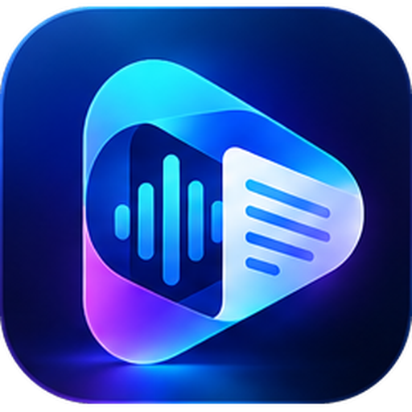

<div align="center">



# EchoScript

**Trascrivi. Traduci. Riassumi. Capisci di più.**

<p align="center">
  
  
  
  
  
  
  
  
  
  
  
</p>

<p align="center">
  Trascrivi i video YouTube <b>e i tuoi audio locali</b> in <b>testo, Markdown, JSON e PDF</b>,<br>
  poi <b>traducili</b> in italiano e ottienine un <b>riassunto pulito</b>, senza "ehm/uhm", ripetizioni e autocorrezioni,<br>
  con <b>formule, grafici, molecole e reazioni disegnati</b> quando il video parla di matematica, statistica, fisica o chimica.<br>
  <b>Velocemente</b> con Groq oppure <b>100% in locale</b> per la massima privacy.<br>
  Pensato per <b>studiare</b> video lunghi leggendoli invece di guardarli per ore.<br>
  <b>Niente abbonamenti, niente limiti giornalieri, niente minutaggio ridotto.</b>
</p>

<p align="center">
  <a href="https://github.com/Imkun-on/EchoScript/releases/latest/download/EchoScript-Setup.exe">
    
  </a>
</p>

<p align="center">
  <sub>Ci clicchi e parte il download dell'installatore. Windows 10/11 a 64 bit.</sub>
</p>

</div>

---

## Indice

- [Installa l'app](#installa-lapp)
- [Cosa fa](#cosa-fa)
- [I due motori: locale o cloud](#i-due-motori-locale-o-cloud)
- [I modelli usati](#i-modelli-usati)
- [Riassunti per materia](#riassunti-per-materia)
- [Cosa produce](#cosa-produce)
- [La chiave Groq](#la-chiave-groq)
- [Per sviluppatori: eseguire dal codice](#per-sviluppatori-eseguire-dal-codice)
- [Com'è fatto dentro](#comè-fatto-dentro)
- [Configurazione](#configurazione)
- [Privacy](#privacy)
- [Note legali e licenza](#note-legali-e-licenza)

---

## Installa l'app

Non serve installare Python né altro.

1. Clicca il bottone verde qui sopra, oppure prendi **`EchoScript-Setup.exe`** dalla pagina **[Releases](https://github.com/Imkun-on/EchoScript/releases/latest)**.
2. Doppio clic, Avanti, Installa.
3. Trovi l'icona sul desktop e la voce nel menu Start.

> Il nome del file non contiene il numero di versione, ed e' voluto: e' cosi' che il bottone qui sopra puo' scaricare sempre l'ultima senza cambiare indirizzo. La versione si legge nelle proprieta' del file e nella voce «App installate».

> 🔓 **Non serve essere amministratore.** Si installa per il tuo account, dentro `%LOCALAPPDATA%\Programs\EchoScript`, e Windows non chiede nessuna conferma di sicurezza. Funziona anche sul computer dell'ufficio.

> 🛡️ **SmartScreen.** Il programma non è firmato digitalmente, quindi Windows può mostrare *"Windows ha protetto il PC"*: clicca **"Ulteriori informazioni" → "Esegui comunque"**. Per controllare di aver scaricato davvero il file pubblicato, confronta l'impronta con quella nelle note della release:
> ```powershell
> Get-FileHash .\EchoScript-Setup.exe -Algorithm SHA256
> ```

**Cosa è incluso:**

- ✅ Tutto: non servono Python, ffmpeg o altre installazioni.
- 🪟 **WebView2**, il componente con cui Windows disegna la finestra, c'è già su Windows 11 e su Windows 10 aggiornato. Se manca, l'installazione se ne accorge e lo scarica da Microsoft.
- 📥 La **prima volta** che usi il motore locale, l'app scarica una tantum il modello da HuggingFace, poi resta in cache anche offline.
- 🧅 Al **primo avvio** l'app scarica anche **Tor** (circa 22 MB), con cui nasconde il tuo IP a YouTube: vedi [Privacy](#privacy).
- ⚡ Per il motore **Groq** serve solo una chiave gratuita, vedi più sotto.
- 💻 L'installatore è per **Windows 10/11 a 64 bit**. Per macOS e Linux si usa per ora l'installazione da sorgente.

**Dove finiscono le trascrizioni.** In `results/`, dentro la cartella del programma. La scorciatoia **«Trascrizioni salvate»** nel menu Start ci porta direttamente.

**Aggiornare.** Scarica il nuovo installatore e lancialo: riconosce la versione presente e la sostituisce. Trascrizioni, preferenze e chiave restano dove sono.

**Disinstallare.** Impostazioni → App → App installate → EchoScript. Alla fine viene chiesto se cancellare anche le trascrizioni: rispondendo **No** restano sul disco.

---

## Cosa fa

Incolli un link di YouTube o scegli un file dal disco, e il programma:

1. **legge cosa c'è dietro** appena incolli il link (titolo, durata, copertina) e ne apre l'anteprima in una finestra, così un link sbagliato si scopre prima di spendere mezz'ora;
2. **scarica solo l'audio**, che pesa dieci volte meno del video. Tutto quello che va verso YouTube passa da **Tor**: YouTube non vede il tuo IP;
3. **lo trascrive**, sui server Groq o sul tuo computer;
4. opzionalmente lo **traduce** in italiano e ne fa un **riassunto** pulito, con formule, grafici, molecole e codice commentato secondo la materia (vedi [Riassunti per materia](#riassunti-per-materia));
5. **salva tutto** in cinque formati, Word compreso.

La finestra ha due sole sezioni, **Locale** e **Cloud**, e nella barra laterale una spia che dice se l'IP è nascosto.

Funziona anche su **playlist intere** e su **cartelle di file audio**, un elemento dopo l'altro. E c'è una **coda**: incolla più link insieme (uno per riga), oppure incollane uno nuovo mentre un lavoro è in corso, e verranno trascritti in fila appena tocca a loro. Basta anche **Ctrl+V** in qualunque punto della finestra: se negli appunti c'è un link, si apre la sua anteprima.

Mentre lavora mostra l'elenco delle fasi, ognuna con **la sua percentuale** e una stima del **tempo che manca** alla fine della fase. Un lavoro si può **annullare** in qualunque momento: si ferma al primo punto sicuro e quello che era fatto resta salvato. Se nel frattempo stavi usando altro, a fine lavoro arriva una **notifica di Windows**.

A lavoro finito, **«Leggi»** apre il riassunto (o la trascrizione) in una finestra, con formule e grafici già disegnati. Il riassunto può essere **esteso, normale, breve o solo i punti chiave**.

In **Locale**, prima di partire il programma controlla che Ollama sia acceso e che il modello sia scaricato, e se manca qualcosa ti dice il comando da lanciare. In **Cloud** avvisa prima se i crediti Groq rimasti non bastano per tutto l'audio.

**Se qualcosa si interrompe** (rete, crediti finiti, finestra chiusa) il lavoro fatto fino a quel punto è salvato: riaprendo il programma e reincollando lo stesso link compare **«Riprendi»**, che riparte dal punto esatto invece che da capo.

**Se i crediti Groq finiscono** il programma non resta ad aspettare: lo dice subito, con l'ora in cui tornano disponibili, e propone di finire sul computer. Aspetta da solo soltanto il limite «al minuto», che si libera in pochi secondi, e mentre aspetta mostra il conto alla rovescia.

Oltre alla finestra c'è anche una **riga di comando** (`python cli/main.py`) che fa le stesse cose con dei menu nel terminale.

---

## I due motori: locale o cloud

È la scelta più importante, e nell'app non è un interruttore: sono due sezioni, «Locale» e «Cloud». Si entra in quella che si vuole usare e si lavora lì dentro.

| | 🔒 Locale | ☁️ Cloud (Groq) |
|---|---|---|
| **Dove va l'audio** | da nessuna parte, resta sul computer | sui server di Groq |
| **Serve una chiave** | no | sì, gratuita |
| **Velocità** | dipende dal computer, da minuti a ore | molto veloce |
| **Limiti** | nessuno, solo il tempo | crediti giornalieri gratuiti |
| **Prima volta** | scarica il modello (da 150 MB a qualche GB) | niente da scaricare |
| **Quando conviene** | audio privati, nessuna fretta, uso intensivo | video pubblici, poco tempo |

Il motore scelto vale per tutto il lavoro: trascrizione, riassunto e traduzione. Non si mescolano mai.

> 🔒 **Offline totale.** Con il motore locale e senza chiave Groq, l'intera catena gira sul tuo computer e nessun dato lo lascia. Servono [Ollama](https://ollama.com) installato e avviato e un modello scaricato, per esempio `ollama pull qwen2.5:7b`.

---

## I modelli usati

EchoScript non è un modello: è un direttore d'orchestra. A seconda di cosa serve e di quale motore hai scelto, chiama il modello giusto.

### Trascrizione: la famiglia Whisper

**Whisper** è il modello di riconoscimento vocale di OpenAI, addestrato su circa 680.000 ore di audio. È lo stesso modello nei due motori: a parità di variante la qualità è identica, cambia solo chi fa i conti.

| Modello | Parametri | Dove | Note |
|---|---|---|---|
| `base` | 74 M | locale | il più leggero, per prove veloci |
| `small` ⭐ | 244 M | locale | l'equilibrio consigliato su processore |
| `medium` | 769 M | locale | più accurato, sensibilmente più lento |
| `large-v3` | 1,55 B | locale e cloud | massima accuratezza |
| `large-v3-turbo` ⭐ | 809 M | locale e cloud | quasi la stessa qualità, molto più veloce |

> 💡 `large-v3-turbo` è una versione **distillata** di `large-v3`: il decoder passa da 32 a 4 strati. Costa e pesa la metà con una perdita minima, ed è il default su Groq.

### Riassunto e traduzione

Sul **cloud** il modello è fisso, perché girando sui server di Groq ci si può permettere un gigante:

| Modello | Parametri | Ruolo |
|---|---|---|
| `openai/gpt-oss-120b` | 117 B (MoE, ~5 B attivi) | riassunto e traduzione |

In **locale** si sceglie dal menu a ogni lavoro:

| Modello | Parametri | RAM | Punti di forza |
|---|---|---|---|
| `qwen3:4b` | 4 B | ~4 GB | il più recente dei piccoli, ottimo in italiano. Ideale con 8 GB |
| `qwen2.5:7b` ⭐ | 7,6 B | ~6 GB | bravissimo a seguire istruzioni strutturate |
| `qwen3:8b` | 8,2 B | ~7 GB | più capiente, riassunti più fedeli sui contenuti tecnici |
| `gemma3:12b` | 12 B | ~10 GB | il multilingua di Google, stile molto naturale |
| `gpt-oss:20b` | 21 B (MoE, ~3,6 B attivi) | ~16 GB | la qualità locale più vicina al cloud |

Con la chiave Groq la **traduzione** passa invece da Google Translate, che è gratuito e non chiede una chiave sua. In locale riusa lo stesso modello del riassunto, così se ne scarica uno solo.

> **Come leggere la colonna RAM.** È quella che il modello occupa mentre gira, e va **sommata** a Windows e alle altre app aperte. Con 8 GB totali conviene restare sui modelli da ~4 GB; con 16 GB gira comodo tutto fino a ~10 GB. Se un modello non ci sta, Ollama usa il disco e diventa molto lento: meglio scendere di taglia.

---

## Riassunti per materia

Il riassunto non è uguale per tutti i video. Per ogni sezione il programma guarda di che cosa si parla (gli bastano poche parole del lessico di una materia) e aggiunge le regole e i disegni di quella materia. Non c'è niente da scegliere, e una lezione può essere di più materie insieme.

| Materia | Cosa entra nel riassunto |
|---|---|
| **Matematica** | Formule scritte in LaTeX e disegnate. Un **piano cartesiano vero**: funzioni, coniche, curve a tratti, parametriche e polari, aree sotto una curva o fra due curve, vettori, angoli, poligoni, campi, successioni, somme di Riemann. Nello **spazio**: superfici, quadriche, curve e vettori in 3D. |
| **Statistica** | **Istogrammi** (anche con classi di ampiezza diversa), **boxplot**, **dispersione** con la retta di regressione, distribuzioni con l'area di una probabilità. Per i dati semplici, grafici a **barre, linee o torta**. |
| **Chimica** | Formule e reazioni scritte come nei libri. **Molecole**: modello 3D a sfere e bastoncini, formula a scheletro per i composti organici, struttura di **Lewis** con le coppie di elettroni. **Reazioni** disegnate, anche come **meccanismo** con le frecce degli elettroni. **Orbitali**: configurazione elettronica a caselle e forma di s, p, d e ibridi. **Curve di titolazione**, **profili di energia**, **reticoli cristallini** e **tavola periodica**. |
| **Fisica** | Grafici del moto, diagrammi delle forze, piani inclinati, campi. |
| **Codice** | Il codice detto nel video, con brevi **commenti** sulle righe che non si spiegano da sole. Il codice non cambia. |

**Niente di inventato.** Un grafico si fa solo con i numeri detti nel video o calcolabili esattamente dalle sue formule. Ogni disegno viene controllato prima di finire sulla pagina: una descrizione sbagliata si scarta, invece di disegnare qualcosa di falso. Per le molecole la struttura deve tornare con la formula, e con il nome IUPAC se sul computer c'è Java; una reazione si disegna solo se è bilanciata. E dove si può il conto lo fa il programma, non il modello: il pH di una titolazione punto per punto, gli elettroni di una struttura di Lewis, il riempimento degli orbitali, la posizione degli atomi in un reticolo.

**Dove si vedono.** Disegnati nel **PDF** e in **«Leggi»**. Nel `.md` i grafici dei dati sono blocchi Mermaid, che GitHub, Obsidian e VS Code mostrano; nel `.txt` e nel `.docx` tutto è descritto a parole.

**Si possono spegnere.** Sono due interruttori sotto «Crea riassunto», accesi di partenza: «Grafici nel riassunto» (tutti i disegni) e «Commenti nei blocchi di codice».

---

## Cosa produce

```
results/
└── <Nome video o nome file>/
    ├── trascrizioni/
    │   ├── <Nome>.md          sezioni con minutaggio, prosa pulita
    │   ├── <Nome>.txt         testo puro, da incollare in un altro modello
    │   ├── <Nome>.json        segmenti con i tempi, per RAG e script
    │   ├── <Nome>.pdf         impaginato, con sommario cliccabile
    │   └── <Nome>.docx        lo stesso testo in Word, da modificare
    ├── traduzioni/            se l'audio non era in italiano
    └── riassunti/             riassunto pulito, per sezione
```

**Perché cinque formati.** Non è ridondanza: ognuno risolve un bisogno diverso.

- **`.md`** per leggere e pubblicare: i minutaggi solo nei titoli, il corpo è prosa scorrevole.
- **`.txt`** per darlo in pasto a un altro modello: niente tempi, niente formattazione.
- **`.json`** per RAG e uso programmatico: metadati, capitoli e tutti i segmenti con i tempi.
- **`.pdf`** per leggere offline, con i capitoli come segnalibri nel pannello laterale.
- **`.docx`** per modificare il testo in Word, LibreOffice o Google Documenti. Le formule restano scritte in LaTeX e i grafici diventano un elenco di valori: disegnati li trovi nel PDF.

**Il PDF viene generato sempre**, con due strategie. Quando ci sono formule o grafici, la pagina viene impaginata da un **browser già presente sul sistema** (Edge su Windows): le formule sono disegnate davvero, non scritte. Niente LaTeX da installare. Se un browser non c'è, si ripiega su un PDF semplice che funziona sempre, anche offline.

**Playlist.** I video finiscono in `results/<nome playlist>/`, con una sottocartella per ciascuno.

---

## La chiave Groq

Serve **solo** per il motore cloud, ed è **gratuita**.

1. Registrati su **[console.groq.com](https://console.groq.com)**.
2. Apri **[API Keys](https://console.groq.com/keys)** e crea una chiave.
3. **Copiala subito**: viene mostrata una volta sola.

Nell'app: sezione «Cloud» → **Carica da file .txt**. Il file può contenere la chiave nuda o una riga tipo `GROQ_API_KEY=gsk_...`, con virgolette o senza: il programma pesca il valore utile da solo.

In alternativa metti `GROQ_API_KEY=gsk_...` nel file `.env` accanto al programma.

> La chiave non è mai scritta nel codice e non viene mai mandata alla pagina dell'interfaccia: resta in memoria in Python, e il file `.env` è escluso dal versionamento.

---

## Per sviluppatori: eseguire dal codice

```bash
git clone https://github.com/Imkun-on/EchoScript.git
cd EchoScript
pip install -r requirements.txt
```

Serve anche **ffmpeg** nel sistema:

```bash
winget install Gyan.FFmpeg      # Windows
brew install ffmpeg             # macOS
sudo apt install ffmpeg         # Linux
```

Poi:

```bash
python EchoScript.py     # la finestra
python cli/main.py       # il terminale
```

Le molecole e le reazioni le disegna **RDKit**, che è nei requisiti; il controllo col nome IUPAC si attiva solo se c'è **Java**. `python tests/prova.py` disegna in un PDF un centinaio di esempi di tutti i grafici e controlla che quelli scritti male vengano scartati (`--muto` per il solo conto). Il logo e l'icona si rifanno con `python assets/marchio.py`, che li ritaglia da `assets/marchio-originale.png`.

### Costruire l'installatore

Servono due strumenti, e fanno due mestieri diversi: **PyInstaller** trasforma il codice Python in un programma vero (`EchoScript.exe` più la cartella `_internal`), **Inno Setup** prende quella cartella e la chiude in un unico file di installazione. Senza il primo non c'è nessun `.exe` da installare; senza il secondo c'è una cartella che chi la riceve deve sistemarsi da sé.

Una volta sola:

```powershell
winget install Gyan.FFmpeg          # finisce DENTRO il pacchetto
winget install JRSoftware.InnoSetup # serve la 6.3 o superiore
pip install pyinstaller
```

Poi:

```powershell
.\costruisci.ps1 -Versione 1.0.0
```

Lo script fa i due passaggi in fila, ripulisce `dist/` da eventuali file di una tua prova, e stampa percorso, peso e impronta SHA256 del file da pubblicare. Con `-SoloInstallatore` salta PyInstaller e riusa `dist/`: un minuto invece di otto.

> ⚠️ **L'eseguibile scrive accanto a sé.** Se apri `dist/EchoScript.exe` per una prova, in quella cartella restano le *tue* preferenze e le *tue* trascrizioni. Impacchettate, finirebbero addosso a chiunque installi il programma. Lo script se ne accorge e chiede di cancellarle, e lo script di installazione le esclude comunque.

### Pubblicare una versione

```bash
git tag v1.0.0
git push origin v1.0.0
```

Il workflow `.github/workflows/pacchetti.yml` costruisce il pacchetto su un computer prestato da GitHub e lo allega alla release, con peso e impronta già nelle note. Serve perché **PyInstaller non fa pacchetti per un sistema diverso da quello su cui gira**: da Windows esce solo roba Windows.

---

## Com'è fatto dentro

```
EchoScript.py       apre la finestra e basta
client/             l'interfaccia: una pagina web dentro la finestra di Windows
server/             il lavoro, diviso per mestiere
  config/           le manopole, i testi, i percorsi
  controllers/      cosa la pagina può chiedere, e il filo fra i due mondi
  services/         il direttore d'orchestra e la stima prima di partire
  sources/          da dove arriva l'audio: YouTube o un file sul disco
  transcription/    l'audio diventa parole: Groq oppure faster-whisper
  enrichment/       riassunto e traduzione
  export/           documento, PDF, Word, e i disegni: piano, spazio, molecole, chimica
  state/            parziali, crediti, fasi già fatte, storico dei lavori
  utils/            quello che serve a tutti, compreso Tor
cli/main.py         i menu del terminale
assets/             il logo e l'icona
tests/prova.py      il collaudo dei disegni
installer/          lo script di installazione per Windows
```

**La regola che tiene insieme tutto:** `server/` non importa mai niente da `cli/`. Il lavoro non sa chi lo sta guardando, e per questo funziona uguale dalla finestra e dal terminale.

**Perché l'interfaccia è una pagina web.** Perché Windows il motore per mostrarla ce l'ha già installato: niente da scaricare, e l'eseguibile pesa decine di megabyte in meno. L'aspetto sta nel CSS, la struttura nell'HTML, il comportamento in un file JavaScript per sezione.

**Come parlano i due mondi.** In una direzione sola ciascuno: la pagina chiama direttamente un metodo Python (nessun server, nessuna porta aperta), e Python manda alla pagina quello che arriva quando vuole lui, cioè righe di diario e avanzamento.

---

## Configurazione

Tutte le manopole si impostano da variabili d'ambiente o dal file `.env` accanto al programma, senza toccare il codice. Ogni valore ha un default sensato, e una variabile del sistema vince sempre sul file.

| Variabile | Default | Cosa cambia |
|---|---|---|
| `GROQ_API_KEY` | | la chiave, solo per il motore cloud |
| `ECHOSCRIPT_GROQ_MODEL` | `whisper-large-v3-turbo` | quale Whisper su Groq |
| `ECHOSCRIPT_AUDIO_LANG` | *(vuoto)* | lingua dell'audio: vuoto = riconoscila da sola |
| `ECHOSCRIPT_WORD_TIMESTAMPS` | `1` | i tempi di ogni singola parola, utili per i sottotitoli |
| `ECHOSCRIPT_CHUNK_SECONDS` | `600` | durata di ogni blocco audio, solo su Groq |
| `ECHOSCRIPT_DEVICE` | `auto` | motore locale: `auto` (GPU se c'è), `cpu`, `cuda` |
| `ECHOSCRIPT_COMPUTE_TYPE` | *(auto)* | precisione locale: vuoto = `float16` su GPU, `int8` su processore |
| `ECHOSCRIPT_GROQ_SUMMARY_MODEL` | `openai/gpt-oss-120b` | quale modello di testo su Groq |
| `ECHOSCRIPT_OLLAMA_MODEL` | `qwen2.5:7b` | quale modello locale per il riassunto |
| `ECHOSCRIPT_OLLAMA_TRANSLATE_MODEL` | *(= sopra)* | modello locale per la traduzione, se diverso |
| `ECHOSCRIPT_OLLAMA_HOST` | `http://localhost:11434` | dove risponde Ollama |
| `ECHOSCRIPT_OLLAMA_NUM_CTX` | `8192` | finestra di contesto: se è piccola il modello legge solo l'inizio |
| `ECHOSCRIPT_SUMMARY_MAX_CHARS` | `12000` | oltre questa soglia una sezione si riassume a blocchi |
| `ECHOSCRIPT_SUMMARY_CHARTS` | `1` | grafici nel riassunto, quando i dati ci sono (valore di partenza dell'interruttore) |
| `ECHOSCRIPT_SUMMARY_CODE_COMMENTS` | `1` | commenti nei blocchi di codice del riassunto (idem) |
| `ECHOSCRIPT_RICH_PDF` | `1` | PDF con formule e grafici disegnati (0 = solo quello semplice) |

> **GPU.** Il motore locale usa la scheda NVIDIA se la trova, altrimenti il processore. Per l'accelerazione installa PyTorch con CUDA, vedi `requirements.txt`.

---

## Privacy

- **YouTube**: informazioni sul video, copertina e audio passano da **Tor**, quindi YouTube vede l'indirizzo di un nodo Tor e non il tuo. Tor si avvia da solo all'apertura (la prima volta viene scaricato da torproject.org in `%LOCALAPPDATA%\EchoScript\tor`) e la spia sotto il logo dice se l'IP è nascosto. Se Tor non parte, YouTube **non** viene contattato con la connessione diretta: il lavoro si ferma con un messaggio. Groq, Ollama e i file dal disco non passano da Tor.
- **Motore locale**: l'audio **non lascia mai il computer**. Al primo uso scarica solo i pesi del modello.
- **Motore Groq**: l'audio viene caricato sui server di Groq. Ottimo per video pubblici, sconsigliato per audio privati.
- **Traduzione**: con la chiave Groq passa da Google Translate, quindi il testo va ai server di Google. Senza chiave traduce Ollama sul tuo computer.
- **Riassunto**: segue il motore scelto. In locale resta tutto sul computer.

La chiave non è mai scritta nel codice: si legge da `.env` o da una variabile d'ambiente, ed è esclusa dal versionamento.

---

## Note legali e licenza

EchoScript scarica l'audio da YouTube per trascriverlo. L'uso può essere soggetto ai Termini di Servizio di YouTube e alle norme sul diritto d'autore della tua giurisdizione. È pensato per uso **personale ed educativo**: usalo per contenuti di cui hai i diritti o per studio personale.

Rilasciato sotto **[PolyForm Noncommercial License 1.0.0](LICENSE)**. In breve, e non è un riassunto legale:

- ✅ **Puoi** usarlo, studiarlo, modificarlo e ridistribuirlo per scopi **non commerciali**: uso personale, ricerca, progetti hobbistici, scuole e università.
- ❌ **Non puoi** venderlo, offrirlo come servizio a pagamento o usarlo nell'attività di un'azienda.
- 📎 Se lo ridistribuisci devi allegare la licenza e mantenere la riga `Required Notice:`.

